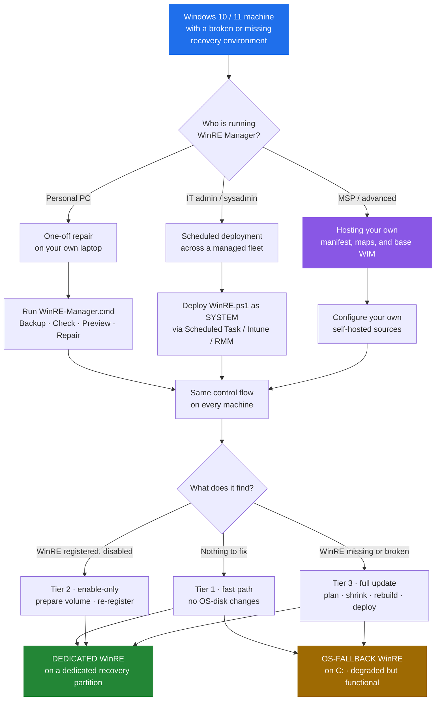
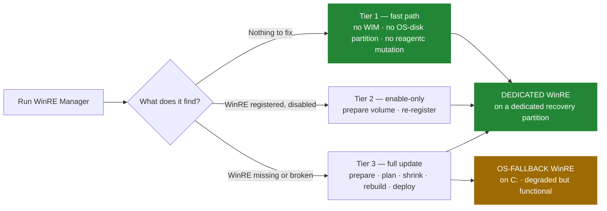

# WinRE Manager

> Rebuild broken Windows recovery environments — on one machine, or ten thousand.

[](https://github.com/ArthurJDurand/WinRE-Manager)
[](https://github.com/ArthurJDurand/WinRE-Manager)
[](CHANGELOG.md)
[](LICENSE)
[](https://github.com/sponsors/ArthurJDurand)

📖 **[Full documentation →](https://ArthurJDurand.github.io/WinRE-Manager/)**

WinRE Manager repairs, rebuilds, and maintains the **Windows Recovery Environment** — the built-in environment Windows uses for **Advanced startup**, **Reset this PC**, and **Startup Repair**. When a rebuild is required and the source image passes the applicable safety checks, it services `winre.wim`, applies the OEM and Intel VMD drivers the recovery environment needs — including the touchpad and input drivers that let a technician navigate WinRE without a keyboard — verifies the registered recovery route, and keeps the recovery partition correctly sized. It runs on one machine, or as a scheduled SYSTEM task across a managed fleet. Safe to re-run: a machine that needs no work takes an idempotent fast path that mounts no WIM, does not modify the OS-disk partition layout, and does not disable, re-register, or enable WinRE.

**Having this problem?** If you're seeing **"Windows could not find the recovery environment,"** **"The Windows RE image was not found,"** **"Unable to reset, no recovery image,"** a failed `reagentc /enable`, a **recovery partition too small after a Windows Update** (`0x80070643`), or **"Startup Repair cannot repair this computer automatically,"** you're in the right place. Every one of those is a real WinRE failure mode where the fix is a correctly serviced recovery image on a correctly sized recovery partition — not a Windows reinstall. See [What WinRE Manager fixes](#what-winre-manager-fixes) for the full list.

---

## Just want to fix WinRE on your PC?

**You do not need to know PowerShell, DISM, DiskPart, BitLocker, or Windows partitioning for the recommended method.**

1. **Download** the latest release: [github.com/ArthurJDurand/WinRE-Manager/releases/latest](https://github.com/ArthurJDurand/WinRE-Manager/releases/latest)
2. **Extract** the archive.
3. **Open** the `scripts` folder and double-click **`WinRE-Manager.cmd`**.

The wrapper opens a menu grouped into sections:

| Section | Option | What it does |
|---|---|---|
| **SAFETY** | **1 — Back up current WinRE** | Captures a byte-for-byte copy of the currently registered WinRE WIM plus a sidecar metadata file. Non-destructive. Recommended before any live repair. |
| **DIAGNOSTICS** | **2 — Test harness** | Read-only checks of your Windows recovery setup. Does not intentionally modify WinRE, partitions, BitLocker, or Windows system state, but may create and remove its own test artifacts under its working directory. |
| | **3 — Preview plan (DryRun)** | Shows what the repair would do without making partition or WinRE changes. |
| | **4 — Show recent log** | Prints the tail of the last run's log and offers to open it in Notepad. |
| **MAINTENANCE** | **5 — Install automatic maintenance** | Registers a SYSTEM scheduled task that runs WinRE Manager on a schedule. |
| | **6 — Remove automatic maintenance** | Unregisters the scheduled task. The installed script copy is left in place. |
| **REPAIR** | **7 — Run WinRE Manager** | Performs the repair after showing a warning and requiring you to type `RUN`. |
| **RECOVERY** | **8 — Restore WinRE from backup** | Writes a previously captured WIM back to the active route. The menu's recovery row shows whether a backup exists at the default location; the restore screen accepts any directory containing `winre.wim` and `backup.json`, including one on an external disk. |
| — | **Q — Quit** | Closes the wrapper. Q appears below the RECOVERY section, without its own section header. |

The wrapper also shows a status line at the top of the menu with the current backup state and whether the automatic-maintenance task is installed.

**First-run workflow.** On a machine that has never run WinRE Manager, take the options in order: **2** (test harness) to confirm the current state, **3** (preview) to see what a live run would do without doing any of it, **1** (backup) to capture the current WinRE before anything changes, then **7** only after the preview looks reasonable.

> **SmartScreen note.** Files downloaded from the internet carry the Mark-of-the-Web flag, and the built-in Windows zip extractor propagates it to the extracted `.cmd`. If double-clicking `WinRE-Manager.cmd` triggers **"Windows protected your PC,"** click **More info** → **Run anyway**. To clear the flag permanently, right-click the `.cmd` → **Properties** → tick **Unblock** → **OK**. Extracting with 7-Zip instead of the built-in extractor avoids the flag altogether.

> **Why the wrapper, not a direct script invocation?** The wrapper keeps the menu open so you can run several operations in sequence without re-launching, gives you a chance to abort at any point before anything destructive happens, and elevates only the specific PowerShell script that needs it. The production script has its own fail-fast elevation guard for the case where it is invoked directly — but the wrapper is the recommended path for everyone.

## Before you run a live repair

WinRE Manager is designed to fail closed and refuses layouts it cannot prove safe. But a live repair can modify Windows disk partitions. **Back up important files before your first live repair.** If BitLocker or Windows Device Encryption is enabled, make sure you know where your **BitLocker / device-encryption recovery key** is stored.

---

## Who is this for?

| You are | Start here |
|---|---|
| 💻 **A single-machine user**, repairing your own laptop | [Just want to fix WinRE?](#just-want-to-fix-winre-on-your-pc) above — download, extract, double-click `WinRE-Manager.cmd`. No PowerShell required. |
| 🏢 **An IT admin or sysadmin**, deploying to a managed fleet | [Deployment](docs/deployment.md) — scheduled task XML, Intune, RMM, MDM. |
| 🔧 **An MSP or sysadmin hosting your own inputs** | [Self-hosting](docs/self-hosting.md) — your own manifest, OEM driver maps, and base WIM repository. |

All three drive the same control flow on every machine.



> **Elevated** means an administrator PowerShell prompt — the current user with the Administrator token. **As SYSTEM** means running under the built-in `NT AUTHORITY\SYSTEM` account, which is how a scheduled task is configured. Production needs one or the other. The read-only test harness runs unelevated when invoked directly, but the recommended wrapper (`WinRE-Manager.cmd`) launches it elevated so BitLocker, partition, and DISM queries return complete data.

---

## What WinRE Manager fixes

WinRE Manager exists because "reinstall Windows" is not a repair. Every problem below is a real Windows failure mode where Startup Repair, Reset this PC, or `reagentc` cannot complete — and where the fix is a correctly serviced recovery image on a correctly sized recovery partition, not a new OS.

### The errors you actually see

Each row is an error string Windows displays or writes to a log, followed by the underlying cause and what WinRE Manager does about it.

| What you see | Underlying cause | What WinRE Manager does |
|---|---|---|
| **"Windows could not find the recovery environment. Insert your Windows installation or recovery media, and restart your PC with the media."** | WinRE is disabled, or `winre.wim` is missing from wherever `reagentc` points. | Rebuilds the WIM, deploys it, re-registers the recovery route. |
| **"The Windows RE image was not found."** (`REAGENTC.EXE: The Windows RE image was not found`) | The recovery partition exists, but `winre.wim` inside it is absent, corrupt, or the wrong build. | Services a fresh image, verifies it by SHA256, deploys it, re-enables. |
| **"Unable to reset, no recovery image."** | Reset this PC cannot find a bootable WinRE image to hand off to. | Restores the image and re-enables WinRE so Reset and Startup Repair work again. |
| **"Could not find the recovery environment"** when starting Advanced startup | `reagentc` is registered to a partition or path that no longer exists. | Classifies the current route, rebuilds the image, restores registration. |
| **"Windows RE status: Disabled"** in `reagentc /info` | The recovery image is present but not registered. | Runs the enable-only path: prepares the target volume, re-registers, calls `reagentc /enable`. No partition work, no rebuild. |
| **`REAGENTC.EXE: Operation failed: b7`** | `reagentc /enable` cannot create a BCD entry, usually after a disk layout change. | Rebuilds the recovery partition geometry, applies the correct type code, re-registers cleanly. |
| **`REAGENTC.EXE: Unable to update Boot Configuration Data`** | The BCD store is inconsistent with the actual recovery partition. | Repairs registration and asserts the whole layout before re-enabling. |
| **`reagentc /enable` fails with `0x4c7` (`ERROR_CANCELLED`)** | Windows is in Audit Mode, OOBE, or sysprep. | Detects this and defers before touching anything, then completes after OOBE. |
| **`reagentc /enable` fails with `0x80070005` (Access Denied)** | The recovery partition has no accessible path, or a security descriptor is blocking it. | Assigns a temporary drive letter, prepares the volume, re-registers. |
| **Windows Update fails with `0x80070643` — the recovery partition is too small for the serviced SafeOS image.** The well-known example is the Windows 10 update **KB5034441**; the underlying failure mode — recovery partition too small after Windows Update — is not KB-specific. | The recovery partition cannot hold the serviced SafeOS image. | Replaces it with a correctly sized partition — actual WIM size plus the Microsoft 250 MiB servicing margin — then re-deploys. |
| **"Startup Repair cannot repair this computer automatically"** | The deployed WinRE lacks the storage-controller driver the machine needs, so it cannot see the OS disk. | Selects and injects the correct VMD package for the machine's CPU generation. See [Input and navigation drivers](#input-and-navigation-drivers) below. |

### Input and navigation drivers

A recovery environment that boots but cannot be navigated is barely a recovery environment. WinRE Manager injects the drivers that let a person actually use WinRE, and that let WinRE actually see the OS disk.

- **Touchpad and input drivers.** OEM WinPE packs (Dell, HP, Lenovo) include the touchpad, keyboard, and input-controller drivers for the vendor's hardware. WinRE Manager resolves the correct OEM pack for the machine's model and injects it — so a technician on an HP consumer laptop can navigate WinRE with the touchpad instead of hunting for a USB keyboard.
- **Intel VMD storage drivers.** On Intel systems configured to use VMD for storage — common on 12th-generation Intel and later laptops, including the HP 15 series — WinRE needs the appropriate VMD / RST storage driver to see the OS disk. Without it, Startup Repair and Reset this PC may fail to access the Windows installation and can surface errors such as `INACCESSIBLE_BOOT_DEVICE`. WinRE Manager detects VMD presence on the machine, resolves the right driver package for the CPU generation, and injects it when required.
- **OEM WinPE packs, resolved per-machine.** Dell, HP, and Lenovo publish WinPE driver packs for their business models. WinRE Manager reads the machine type, resolves the correct pack, downloads and extracts it with the vendor's own extractor, and injects the applicable INFs.
- **Injection verified, not assumed.** `Add-WindowsDriver`'s return shape is unreliable across DISM builds. WinRE Manager judges injection success by third-party driver-count delta plus an INF-basename cross-reference between the extracted package and the mounted image.
- **Source-ownership classification (v49).** Every candidate source image is classified before the strip-and-reinject pipeline runs. A WIM that a vendor populated with its own third-party drivers is preserved as-is — the manager will not strip and re-inject over a foreign WIM it did not deploy. A manager-owned, manager-lineage, or in-box WIM is stripped to zero third-party drivers and re-injected with the current recipe.
- **Pre-deployment storage-driver applicability gate (v49).** The gate runs inside Step 3, after injection is confirmed complete, before ResetBase and before the dismount. The manager verifies that the candidate image contains an INF whose `HardwareID` or `CompatibleID` matches one of the machine's present SCSIAdapter-class devices. A candidate that does not match is refused, dismounted with `-Discard`, and deferred. The refusal exits `EXIT_WARNING` before any WIM is written to the active route — no Step 4, no partition work, no deployment. This was added after a field case where a machine's controller was not in the manifest and the earlier pipeline would have deployed a candidate with no driver for it — a recovery environment that boots but cannot see the OS disk.
- **Never-downgrade storage-driver check (v49).** After injection completes and before ResetBase, the manager compares each storage-class driver in the final image against the pre-strip inventory, matched by INF basename. If any post-injection driver would be older than the source's version of the same basename, the entire candidate is discarded — not just the offending driver — the mounted image is dismounted with `-Discard`, the source is preserved, the state file records `ForeignSourceAcceptedHash`, and the run exits `EXIT_WARNING`. The response is deliberately conservative: the whole source is preserved rather than a partial fix.

### Recovery partition geometry

- **A missing recovery partition.** Some OEM images ship without one. WinRE Manager plans a replacement geometry, shrinks C: by the minimum required, and creates a dedicated recovery partition on the aligned boundary.
- **An undersized recovery partition.** If the existing partition cannot hold the serviced WIM plus Microsoft's 250 MiB servicing margin, WinRE Manager replaces it. A partition that cannot meet the margin will fail the next Windows Update — accepting it would be worse than replacing it.
- **A recovery partition separated from C: by a data partition (v48).** A machine laid out as `C: | D: | Recovery` is now handled automatically: the manager identifies `D:` as an *intervening anchor*, validates it against a strict set of read-only safety conditions, shrinks it from the right, and creates a new recovery partition adjacent to the shrunk anchor. The scope is deliberately narrow — exactly one non-recovery partition between C: and the recovery partition cluster, no partition-moving, no anchor extension. Multi-intervening layouts (`C: | D: | E: | Recovery`) still defer stably with a named reason.
- **A recovery partition on a non-OS disk.** A stray type-coded recovery partition on a secondary disk can cause Startup Repair to point the BCD at the wrong image. WinRE Manager removes type-coded recovery partitions from non-OS disks.
- **An OEM factory-restore volume carrying the recovery type code.** Recovery-typed partitions over 2 GiB are preserved for operator review — never deleted, never reused. Windows Setup recovery partitions are under 1.5 GiB; OEM factory volumes can be 7–20 GiB and may carry the same type code.
- **A VHDX-boot machine (v49).** The manager refuses to run destructive operations when the OS disk's bus type is `File Backed Virtual` **and** at least one other disk is on a physical bus — the native-boot VHD/VHDX topology, where the running OS disk is a VHD stored on a host physical disk. A hypervisor guest whose entire storage stack is virtual is not refused. The fail-closed refusal prevents a partial sequence from leaving the machine without a working recovery route.

Because the plan rejects the entire layout when it detects an oversized recovery-typed partition on the OS disk, any run that requires a rebuild defers with `EXIT_WARNING` until the operator resolves the partition. The script will not silently accept a layout it cannot prove safe, and it does not write a retry-suppressing deferral marker for this condition.

### Build drift and stale images

- **Windows Update leaves the registered WinRE newer than the deployed one.** WinRE Manager compares the registered image's DISM servicing metadata against the last-deployed metadata recorded in the state file. Drift forces a rebuild; stability stays on the fast path.
- **Hardware or deployment inputs changed** — a CPU swap, a Windows build change, or a VMD configuration change detected online. WinRE Manager recomputes the deployment identity and rebuilds the WIM against the new inputs. Offline, VMD state cannot be independently verified because its detection rules come from the downloaded manifest — a documented residual of the offline fallback.
- **OEM pack or driver manifest version bumped.** The deployment identity changes and the machine rebuilds once. Healthy machines on the same inputs stay on the fast path.

---

## How it works

Three tiers of work. A healthy machine takes Tier 1; a machine with an enable-only repair takes Tier 2; only a machine that needs a full update takes Tier 3.



- **Tier 1 — fast path.** Health checks pass, the state file matches the current inputs, the image is current, the partition is correct. The run completes without mounting the WIM, modifying the OS-disk partition layout, or issuing a `reagentc` mutation. Runtime is dominated by Windows' own CIM and PnP enumeration.
- **Tier 2 — enable-only.** The image is current, but WinRE is disabled. The script prepares the target recovery partition, re-registers the image, and calls `reagentc /enable`. No partition geometry change, no image rebuild, no C: shrink.
- **Tier 3 — full update.** The image is missing, stale, or the recovery partition is wrong-sized. This is the only path that may perform destructive partition changes — and even here, every preparation completes before the first byte of the recovery partition is touched. If driver download fails, or OEM pack extraction produces zero INFs, or the base WIM cannot be verified, or the strip stage cannot prove zero third-party drivers remain, **the script stops before it touches the recovery partition** and the old recovery route stays intact. If the destructive attempt runs but cannot create a dedicated partition, the machine ends in **OS-fallback** instead: WinRE is functional on `C:\Recovery\WindowsRE`, the run exits `EXIT_WARNING` (code 2), and the state file records `UsedOSFallback = true` so subsequent runs preserve that outcome rather than re-attempting the same destructive sequence.

Full pipeline, checkpoints, and the state model: **[Architecture](docs/architecture.md)** and **[State and idempotency](docs/state-and-idempotency.md)**.

## Design invariants

The whole design is organized around four rules, in this order:

1. **Never break Windows RE.**
2. **Never leave a machine without a working recovery route** — to the extent the machine, its OS, and its storage stack allow.
3. **Minimize the `reagentc /disable` → `reagentc /enable` window.**
4. **Do no work unless needed. When work is needed, prepare everything before touching anything.**

Rules 1–3 are **invariants**: no code change may weaken them. Rule 4 is the **working rule** — the discipline by which rules 1–3 are enforced on the fast path, the enable-only path, and the destructive path.

Full hierarchy, enforcement tables, and reasoning: **[Architecture](docs/architecture.md)**.

## Safety by design

WinRE Manager's safety measures are implemented in the code rather than relying on operator assumptions. Each of the protections below is enforced by the script — not left to operator discretion.

- **Idempotent fast path.** A healthy machine exits without mounting a WIM, modifying the OS-disk partition layout, or issuing a `reagentc` mutation. Runtime is dominated by Windows' own CIM and PnP enumeration.
- **Plan before change.** A read-only geometry plan runs before WinRE is disabled or any partition is deleted. The plan refuses layouts it cannot prove safe, and names the offending partition when it does.
- **Reversible failure window.** The C: pre-shrink runs **before** `reagentc /disable` and **before** any deletion. A failed pre-shrink leaves the old recovery route intact.
- **Fail closed on the destructive sequence.** If the active WinRE route cannot be resolved, or the OS partition cannot be resolved for the layout assertion, the sequence stops before touching the disk.
- **Transactional WIM replacement (v48).** The active route's WIM is preserved as a rollback copy before the new one is staged. On a copy failure, the previous WIM is restored from the rollback copy and hash-verified; a rollback-restore failure is reported separately.
- **Source-ownership classification (v49).** Every candidate source WIM is classified before the strip-and-reinject pipeline runs. A foreign WIM with vendor-injected drivers is preserved as-is; the manager will not normalize a source it did not deploy. See the source-ownership bullet in [SECURITY.md](SECURITY.md) for the trust implications.
- **Pre-deployment storage-applicability gate (v49).** Runs inside Step 3, after injection is confirmed complete, before ResetBase and before the dismount: the candidate must contain an INF matching one of the machine's actual storage controllers. A candidate that does not match is refused, dismounted with `-Discard`, and deferred. The refusal exits `EXIT_WARNING` before any WIM reaches the active route.
- **Never-downgrade storage-driver check (v49).** A storage driver that would be a version downgrade against one already present in the mounted image is refused by discarding the entire candidate — the mounted image is dismounted with `-Discard`, the source is preserved, the state file records `ForeignSourceAcceptedHash`, and the run exits `EXIT_WARNING`. The whole source is preserved rather than partially normalized.
- **Native-boot VHDX fail-closed gate (v49).** The manager refuses to run destructive operations on a machine whose OS volume is on a native-boot VHDX, before any partition work.
- **Backup and restore (v49).** The wrapper exposes a byte-for-byte backup of the currently registered WinRE WIM, and a restore operation that writes a previously captured WIM back to the active route transactionally. Backup is non-destructive; restore validates the backup, resolves the current route, and uses the existing deployment machinery.
- **Temporary crash-recovery task (v49).** Every Repair or Restore run registers a scheduled task that fires shortly after the next boot and once within the hour, so an interrupted run — including a Ctrl+C, a hard kill, or a reboot — is resumed rather than left half-finished. The task is deleted on clean completion. See [SECURITY.md](SECURITY.md) for the privileged-execution implications.
- **Stable install location for the maintenance task (v49).** The wrapper's install option copies the local `WinRE.ps1` to `C:\ProgramData\OEM\WinRE-Manager\`, SHA256-verifies the copy, and registers the scheduled task against the installed copy — not the operator's local clone. A hash mismatch aborts the install and refuses to register the task.
- **Targeted.** WinRE is prepared on its *target* volume. C:'s BitLocker state is never modified by the script.
- **Isolated workspace.** Scratch uses internal fixed NTFS volumes only. USB, SD/MMC, network, FireWire, Fibre Channel, and unknown-bus disks are excluded.
- **Single instance.** A kernel-enforced file lock prevents two runs from colliding on the same machine.
- **Architecture gate (v48).** The manager refuses to run on any architecture other than x64, before any state mutation.
- **Elevation guard (v48 patch 2).** An unelevated launch is refused in milliseconds with a clear message — before the program lock, before hardware probes, before any network fetch.
- **Typed confirmation.** The interactive wrapper requires typing `RUN` before the destructive path begins, and `RESTORE` before a restore operation.

Full safety model — workspace selection, the pre-shrink window, the transactional WIM replacement, the deferral marker, the architecture gate, and the resume task: **[Architecture](docs/architecture.md)** and **[Recovery partition](docs/recovery-partition.md)**.

## Requirements

- **Windows 10** (build 19041+) or **Windows 11** (build 22000+). Windows 11 24H2 and the 25H2 builds are explicitly supported.
- **PowerShell 5.1** or **PowerShell 7.x**.
- **x64 OS architecture.** The manager refuses to run on ARM64, x86, or any architecture whose token cannot be resolved. ARM64 support is not claimed.
- **A physical disk for the Windows volume — not a VHDX.** WinRE Manager refuses to run destructive operations on a machine whose Windows volume is on a native-boot VHDX (a virtual hard disk that the PC boots from directly, rather than a disk that only exists inside a virtual machine). The partition operations it performs are not reliable under that setup. This is uncommon — normal PCs boot from a physical disk — but the check exists so the manager never risks damaging a configuration it was not built for. If it applies to your machine, the run exits with a warning and changes nothing. *(v49)*
- **Elevation or SYSTEM** for production. The read-only test harness runs unelevated when invoked directly; the recommended wrapper (`WinRE-Manager.cmd`) launches it elevated for complete query results. An unelevated launch of `WinRE.ps1` is refused in milliseconds with a clear `FATAL` message, rather than failing several minutes later at `Mount-WindowsImage`.
- **7-Zip** at `C:\Program Files\7-Zip\7z.exe`. The script attempts installation via `winget` if missing.
- **Internet access** to `gist.github.com`, `api.github.com`, `downloads.dell.com`, `ftp.ext.hp.com`, and `download.lenovo.com` for the first deployment on a fresh machine. On a machine whose state file is present and whose local safety checks pass, an outage does not prevent the run. All five external artifacts can be self-hosted; see **[Self-hosting](docs/self-hosting.md)**.
- **Windows is in a normal-running state.** The script defers on OOBE and Audit Mode.

There is **no BitLocker precondition on the OS volume**. The policy is target-volume-based: the enable-only and dedicated-partition paths do not depend on C:'s BitLocker state. Only the OS-fallback route does, because there the target volume *is* C:.

---

## Advanced usage

> **Most users should not use the commands in this section.** Use `WinRE-Manager.cmd` instead. This section is for scripting, CI, and pinned-version deployments.

### Direct PowerShell invocation

From the repository root, in an elevated PowerShell:

```powershell
powershell -ExecutionPolicy Bypass -File .\scripts\Test-WinRE.ps1          # read-only, unelevated
powershell -ExecutionPolicy Bypass -File .\scripts\WinRE.ps1 -DryRun       # elevated
powershell -ExecutionPolicy Bypass -File .\scripts\WinRE.ps1               # elevated
```

The examples above use Windows PowerShell 5.1 (`powershell.exe`). If you are running PowerShell 7, substitute `pwsh` for `powershell` — the script works with either, and the harness runs unelevated in both when invoked directly. The production script needs elevation or SYSTEM. (The recommended wrapper, `WinRE-Manager.cmd`, launches the harness elevated for complete query results — see the wrapper's menu description above.)

### Backup and restore actions

```powershell
# Backup — writes to a timestamped subdirectory of the supplied destination.
powershell -ExecutionPolicy Bypass -File .\scripts\WinRE.ps1 -Action Backup -BackupPath "D:\WinRE-Backups"
# Restore — point at the specific timestamped directory produced by Backup,
# not the backup root. Substitute the directory reported by the backup run
# (e.g. D:\WinRE-Backups\2026-10-09_143000).
powershell -ExecutionPolicy Bypass -File .\scripts\WinRE.ps1 -Action Restore -BackupPath "D:\WinRE-Backups\<timestamp>"
```

Backup captures a byte-for-byte copy of the currently registered WinRE WIM plus a sidecar `backup.json` recording the source hash, size, and DISM servicing metadata. Restore validates the backup, resolves the current route, and writes the WIM back transactionally — it does not create a new partition or invent a replacement route. A usable current WinRE route must already exist.

### One-liners (no local clone)

Save the script to a temp path and run it in a child process:

```powershell
$p = "$env:TEMP\WinRE.ps1"
Invoke-RestMethod -Uri 'https://raw.githubusercontent.com/ArthurJDurand/WinRE-Manager/main/scripts/WinRE.ps1' -UseBasicParsing -OutFile $p
powershell -ExecutionPolicy Bypass -File $p -DryRun
```

Substitute the `Test-WinRE.ps1` URL to fetch the read-only harness, and drop `-DryRun` to run for real. The save-and-run form isolates the script in a child process, keeps your shell open, and exposes `$LASTEXITCODE` — the right shape for anything you care about. On PowerShell 7, replace `powershell` with `pwsh`.

> **Do not pipe the fetched content to `Invoke-Expression`.** The script begins with a UTF-8 byte-order mark followed by a comment-based-help block. Piping the fetched text through `Invoke-Expression` does not strip the BOM before parsing, so the parser does not recognize the help block as a comment and fails on its content. The save-and-run form handles the BOM correctly because the file parser does. See **[Troubleshooting](docs/troubleshooting.md)** for the full explanation.

> **Execution policy note.** The `-ExecutionPolicy Bypass` flag applies only to the child process running the script; it does not change your machine's execution policy.

> **Trust note.** Downloading a script from the internet and executing it is convenient but you should be comfortable with the source. The URLs above all point to the project's own GitHub repository at `raw.githubusercontent.com/ArthurJDurand/WinRE-Manager`, over HTTPS. If you prefer, clone the repo and run the local copy — the code is identical. Pin a release tag for anything you deploy broadly.

### Fleet deployment

Run `WinRE.ps1` as `NT AUTHORITY\SYSTEM` on a scheduled task. The deployment doc's XML template uses a boot trigger and a weekly trigger; the wrapper's install option (`WinRE-Manager.cmd`, option **5**) uses startup with a five-minute delay and a 30-day recurring trigger at 03:00, and pins the task to a stable installed copy of the script so the task survives deletion or relocation of the operator's local clone. Ready-to-paste task XML and MDM guidance are in **[Deployment](docs/deployment.md)**.

## Exit codes

| Code | Meaning |
|---:|---|
| `0` | Healthy, or successfully repaired |
| `1` | Reboot required to complete registration |
| `2` | Warning, safe deferral, OS-fallback, or a non-fatal cleanup issue |
| `3` | Fatal failure — investigate the log |

Full matrix and orchestration policy: **[Exit codes](docs/exit-codes.md)**.

## Current release

| Component | Version |
|---|---|
| `scripts/WinRE.ps1` | **v49 patch 1** |
| `scripts/Test-WinRE.ps1` (read-only harness) | **v29** |
| `scripts/WinRE-Manager.cmd` | (interactive wrapper; rewritten in v49 patch 1) |

**v49** is the largest single release since v48. It ships the ASUS-incident containment work (source-ownership classification, never-downgrade, storage-applicability gate), the native-boot VHDX fail-closed gate, backup and restore actions, human-readable narration and run-summary output, a temporary crash-recovery scheduled task, and a rewritten interactive wrapper. `ScriptVersion` moves from 48 to 49, so every managed machine performs one full-update pass on its next scheduled run, then returns to the fast path. Full release notes, migration steps, and per-machine field evidence are in **[CHANGELOG.md](CHANGELOG.md)**.

## Field-tested hardware

Selected results. Full per-machine evidence is in the [changelog](CHANGELOG.md).

| Vendor | Model | OS | Result |
|---|---|---|---|
| ASUS | PRIME H510M-D (i5-11400) | Win11 26300 | v47 patch 1 — clean non-destructive migration from v46; two subsequent runs on the fast path |
| AB8139 (DMI) | LX15PRO (Ryzen 7 5825U) | Win11 26300 | v48 patch 1 — first field validation of the intervening-anchor path on the exact `C: \| D: \| Recovery` layout that motivated it |
| Dell | Pro Max 16 Premium MA16250 (Core Ultra 7 265H) | Win11 26300 | v47 patch 2 — full rebuild with Dell WinPE11 A10 OEM pack; 64 drivers injected; fast path on the second run |
| ASUS | Vivobook X1504ZA (i3-1215U) | Win11 26300 | v47 patch 2 — C: actively encrypting at 91% during run; dedicated-partition path completed; new recovery partition not re-claimed by Device Encryption |
| HP | EliteBook 8 G1i 16" (Core Ultra 5 235U) | Win11 26300 | v46 patch 2 — clean destructive rebuild; first field exercise of the build-drift log lines |
| Lenovo | IdeaPad 3 15IAU7 (MT 82RK) | Win11 26200 | v46 patch 1 — the machine that motivated the plan-clamp fix; after state-file reset, second full update reached DEDICATED |
| (VM) | Hyper-V Win11 GPT / Win10 MBR | Win11 26300 / Win10 19045 | v45 patch 1 — destructive path verified on the Win11 GPT VM; MBR attribute-application path verified on the Win10 MBR VM (reuse path, not destructive MBR) |

The v44 patch 7 destructive path is field-verified on encrypted C: across eight distinct physical machines (Intel 12th–15th gen and AMD, Dell/HP/Lenovo/ASUS chassis). **v49-specific field verification is partially complete.** Verified on physical hardware (an ASUS PRIME H510M-D, 2026-10-09): the Ctrl+C resume-task preservation path — an interrupted run left the resume task in place, and the subsequent run detected the leftover task and re-registered it — the clean-completion removal of the resume task, and the harness's Option S DSI mirror producing a `DSI MATCH` against production on the same machine. The outstanding items are documented in the [v49 entry](CHANGELOG.md): provenance-marker survival across a real Windows Update servicing event; two-version `iastorvd.inf` coexistence; the storage-applicability gate's false-negative rate (it has never fired in the field); the deliberate post-deletion failure test on a VM; the temporary resume task's persist behaviour on the outer-catch, `Invoke-RestoreAction`, hard-kill, and reboot cases; the wrapper's backup and restore options with paths containing spaces; and the wrapper's install / reinstall of the permanent maintenance task with the installed copy verified after the local script is renamed. The remaining coverage gaps — post-deletion failure on the intervening-anchor path, the v48 multi-intervening and surplus rejections, the transactional-WIM rollback branch, and the architecture gate on ARM64 — are documented in **[Testing](docs/testing.md)**.

## Documentation

| Guide | Use it for |
|---|---|
| [Deployment](docs/deployment.md) | Scheduled tasks, MDM, fleet rollout, and deployment-time translations of the four design invariants |
| [Self-hosting](docs/self-hosting.md) | Replacing the manifest, OEM maps, and base WIM repository with your own hosting |
| [Architecture](docs/architecture.md) | The four design invariants, the pipeline, the control-flow invariants, and the state-carrying artifacts |
| [Recovery partition](docs/recovery-partition.md) | Sizing, geometry planning, replacement behavior |
| [Driver injection](docs/driver-injection.md) | OEM/VMD selection, downloads, validation, and the third-party driver strip stage |
| [State and idempotency](docs/state-and-idempotency.md) | `DesiredStateId`, checkpoints, deployment state, deferral sidecar |
| [Testing](docs/testing.md) | Read-only harness and recommended regression checks |
| [Troubleshooting](docs/troubleshooting.md) | Log signatures and operator recovery steps |
| [Exit codes](docs/exit-codes.md) | Full exit-code matrix and orchestration policy |
| [Changelog](CHANGELOG.md) | Release history and per-machine field evidence |

## Contributing

Bug reports and PRs welcome. See **[CONTRIBUTING.md](CONTRIBUTING.md)**.

Questions and general discussion: **[GitHub Discussions](https://github.com/ArthurJDurand/WinRE-Manager/discussions)**.

## Security

For security issues, see **[SECURITY.md](SECURITY.md)**. Do not file public issues for vulnerabilities.

## Sponsor

If WinRE Manager saves you time: **[https://github.com/sponsors/ArthurJDurand](https://github.com/sponsors/ArthurJDurand)**

## License

MIT — see **[LICENSE](LICENSE)**.
