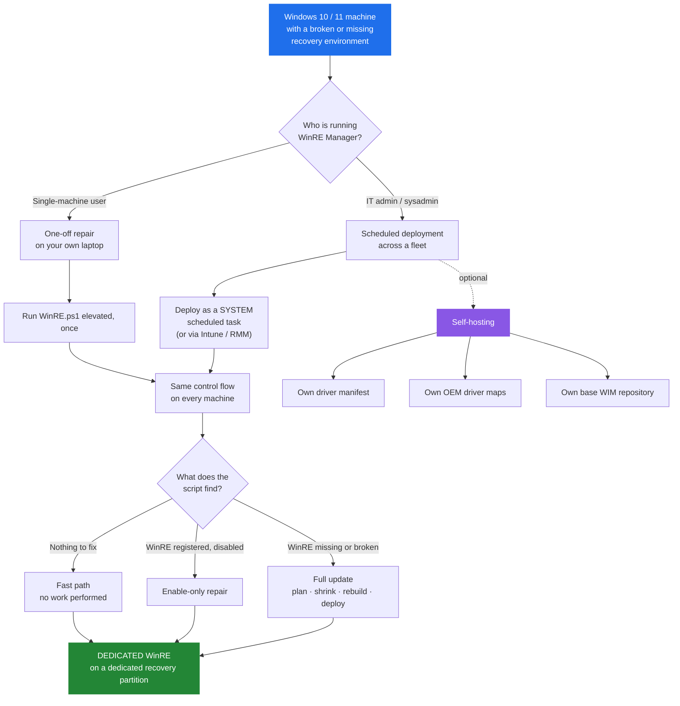
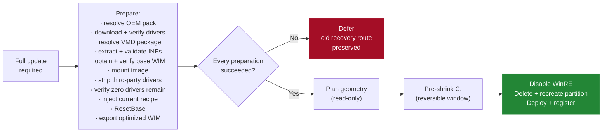

# WinRE Manager

> Rebuild broken Windows recovery environments — on one machine, or ten thousand.

[](https://github.com/ArthurJDurand/WinRE-Manager)
[](https://github.com/ArthurJDurand/WinRE-Manager)
[](CHANGELOG.md)
[](LICENSE)
[](https://github.com/sponsors/ArthurJDurand)

📖 **[Full documentation →](https://ArthurJDurand.github.io/WinRE-Manager/)**

WinRE Manager repairs, rebuilds, and maintains the **Windows Recovery Environment** (WinRE / Windows RE) on Windows 10 and 11. It services `winre.wim`, injects the OEM and Intel VMD drivers the recovery environment actually needs — including the touchpad and input drivers that let a technician navigate WinRE without a keyboard — verifies the registered recovery route, and keeps the recovery partition correctly sized. It runs on one machine, or as a scheduled SYSTEM task across a managed fleet. Safe to re-run: a machine that needs no work takes an idempotent fast path that mounts no WIM, touches no partition, and makes no `reagentc` call.

If you landed here searching for **"fix Windows Recovery"**, **"repair Windows Recovery Environment"**, **"fix WinRE"**, **"repair WinRE"**, **"Windows could not find the recovery environment"**, **"The Windows RE image was not found"**, **"Unable to reset, no recovery image"**, **"recovery image not found"**, **"`reagentc /enable` failed"**, **"recovery partition too small after KB5034441"**, **"0x80070643"**, **"reagentc failed to enable"**, or **"Startup Repair cannot repair this computer automatically"**, jump to [What WinRE Manager fixes](#what-winre-manager-fixes).

## Quick Start

Everything below runs the same production script. Pick the level of action you want. Full documentation is at **[ArthurJDurand.github.io/WinRE-Manager](https://ArthurJDurand.github.io/WinRE-Manager/)**.

### 1. Open an elevated PowerShell

The diagnostic harness below runs unelevated. The dry-run and repair commands need an **elevated** PowerShell prompt — the current user with the Administrator token.

Easiest way to get one: press **Win+X**, then **A** (Windows Terminal as Administrator), or press **Win+R**, type `powershell`, then press **Ctrl+Shift+Enter**.

From inside any PowerShell (or cmd.exe), you can also open a fresh elevated window with:

```powershell
Start-Process powershell -Verb RunAs
```

> **Execution policy note.** The Quick Start commands invoke the downloaded scripts through `powershell -ExecutionPolicy Bypass -File`. That flag applies only to the child process running the script; it does not change your machine's execution policy. If you run a downloaded script directly (`& $p` or `.\script.ps1`), your policy may block it. See [One-liners (advanced)](#one-liners-advanced) for the direct-execution alternatives and their trade-offs.

### 2. Read-only diagnostic (no elevation required)

Changes nothing. Prints the current WinRE state, partition layout, driver inventory, and deployment inputs. Safe to run on a production machine at any time.

```powershell
$p = "$env:TEMP\Test-WinRE.ps1"
Invoke-RestMethod -Uri 'https://raw.githubusercontent.com/ArthurJDurand/WinRE-Manager/main/scripts/Test-WinRE.ps1' -UseBasicParsing -OutFile $p
powershell -ExecutionPolicy Bypass -File $p
```

The harness opens an interactive menu. **Option 1** is the system diagnostic.

### 3. Dry run — walk the full flow, change nothing

An elevated PowerShell is required. This traces every decision the production script would make and writes the same log lines, but touches no partition, no WIM, and no `reagentc` state.

```powershell
$p = "$env:TEMP\WinRE.ps1"
Invoke-RestMethod -Uri 'https://raw.githubusercontent.com/ArthurJDurand/WinRE-Manager/main/scripts/WinRE.ps1' -UseBasicParsing -OutFile $p
powershell -ExecutionPolicy Bypass -File $p -DryRun
```

### 4. Repair

The real thing. Rebuilds the recovery image and re-registers WinRE if the machine needs it; otherwise takes the fast path and exits without doing any work.

```powershell
$p = "$env:TEMP\WinRE.ps1"
Invoke-RestMethod -Uri 'https://raw.githubusercontent.com/ArthurJDurand/WinRE-Manager/main/scripts/WinRE.ps1' -UseBasicParsing -OutFile $p
powershell -ExecutionPolicy Bypass -File $p
```

### If you cloned the repo

The classic local form works identically. From the repository root, in an elevated PowerShell:

```powershell
powershell -ExecutionPolicy Bypass -File .\scripts\Test-WinRE.ps1          # read-only, unelevated
powershell -ExecutionPolicy Bypass -File .\scripts\WinRE.ps1 -DryRun       # elevated
powershell -ExecutionPolicy Bypass -File .\scripts\WinRE.ps1               # elevated
```

### One-liners (advanced)

If you want the shortest possible invocation and accept that the script runs in your current session — including its final `exit` — use:

```powershell
Invoke-RestMethod -Uri 'https://raw.githubusercontent.com/ArthurJDurand/WinRE-Manager/main/scripts/Test-WinRE.ps1' -UseBasicParsing | Invoke-Expression
```

**`Invoke-Expression` cannot pass parameters.** For `WinRE.ps1` with `-DryRun` or any other switch, use the scriptblock form. It has the same current-session caveat, but the arguments work:

```powershell
& ([scriptblock]::Create((irm 'https://raw.githubusercontent.com/ArthurJDurand/WinRE-Manager/main/scripts/WinRE.ps1' -UseBasicParsing))) -DryRun
```

The save-and-run form above is preferable for anything you care about: it isolates the script in a child process, keeps your shell open, and exposes `$LASTEXITCODE`.

### Reproducible runs (pinned version)

`main` tracks the current release. For a fixed, reproducible version, replace `main` with a release tag — `v47.2` for the current v47 patch 2 release:

```powershell
$p = "$env:TEMP\WinRE.ps1"
Invoke-RestMethod -Uri 'https://raw.githubusercontent.com/ArthurJDurand/WinRE-Manager/v47.2/scripts/WinRE.ps1' -UseBasicParsing -OutFile $p
powershell -ExecutionPolicy Bypass -File $p -DryRun
```

### A word about the remote-run pattern

Downloading a script from the internet and executing it is convenient but you should be comfortable with the source. The URLs above all point to the project's own GitHub repository at `raw.githubusercontent.com/ArthurJDurand/WinRE-Manager`, over HTTPS. If you prefer, clone the repo and run the local copy — the code is identical. Pin a release tag for anything you deploy broadly.

### Fleet deployment

Run `WinRE.ps1` as `NT AUTHORITY\SYSTEM` on a scheduled task triggered at boot and weekly. Ready-to-paste task XML and MDM guidance are in [`docs/deployment.md`](docs/deployment.md).

> **Elevated** means an administrator PowerShell prompt — the current user with the Administrator token. **As SYSTEM** means running under the built-in `NT AUTHORITY\SYSTEM` account, which is how a scheduled task is configured. Production needs one or the other. The test harness needs neither.

## Who it's for

Two audiences. Both drive the same control flow.



| You are | Start here |
|---|---|
| **A single-machine user**, repairing your own laptop | [Quick Start](#quick-start) above |
| **An IT admin or sysadmin**, deploying to a managed fleet | [`docs/deployment.md`](docs/deployment.md) |
| **An MSP or sysadmin hosting your own inputs** | [`docs/self-hosting.md`](docs/self-hosting.md) |

## What WinRE Manager fixes

WinRE Manager exists because "reinstall Windows" is not a repair. Every problem below is a real Windows failure mode where Startup Repair, Reset this PC, or `reagentc` cannot complete — and where the fix is a correctly serviced recovery image on a correctly sized recovery partition, not a new OS.

### The errors you actually see

Each row is an exact error string Windows displays or writes to a log, followed by the underlying cause and what WinRE Manager does about it.

| What you see | Underlying cause | What WinRE Manager does |
|---|---|---|
| **"Windows could not find the recovery environment. Insert your Windows installation or recovery media, and restart your PC with the media."** | WinRE is disabled, or `winre.wim` is missing from wherever `reagentc` points. | Rebuilds the WIM, deploys it, re-registers the recovery route. |
| **"The Windows RE image was not found."** (`REAGENTC.EXE: The Windows RE image was not found`) | The recovery partition exists, but `winre.wim` inside it is absent, corrupt, or the wrong build. | Services a fresh image, verifies it by SHA256, deploys it, re-enables. |
| **"Unable to reset, no recovery image."** | Reset this PC cannot find a bootable WinRE image to hand off to. | Restores the image and re-enables WinRE so Reset and Startup Repair work again. |
| **"Could not find the recovery environment"** when starting Advanced startup | `reagentc` is registered to a partition or path that no longer exists. | Classifies the current route, rebuilds the image, restores registration. |
| **"Windows RE status: Disabled"** in `reagentc /info` | The recovery image is present but not registered. | Runs the enable-only path: prepares the target volume, re-registers, calls `reagentc /enable`. No partition work, no rebuild. |
| **`REAGENTC.EXE: Operation failed: b7`** | `reagentc /enable` cannot create a BCD entry, usually after a disk layout change. | Rebuilds the recovery partition geometry, applies the correct type code, re-registers cleanly. |
| **`REAGENTC.EXE: Unable to update Boot Configuration Data`** | The BCD store is inconsistent with the actual recovery partition. | Repairs registration and asserts the whole layout before re-enabling. |
| **`reagentc /enable` fails with `0x4c7` (`ERROR_CANCELLED`)** | Windows is in Audit Mode, OOBE, or sysprep. | Detects this and defers before touching anything, then completes after OOBE. |
| **`reagentc /enable` fails with `0x80070005` (Access Denied)** | The recovery partition has no accessible path, or a security descriptor is blocking it. | Assigns a temporary drive letter, prepares the volume, re-registers. |
| **Recovery partition too small after Windows Update** (`KB5034441`, `0x80070643`) | The recovery partition cannot hold the serviced SafeOS image. | Replaces it with a correctly sized partition — actual WIM size plus the Microsoft 250 MiB servicing margin — then re-deploys. |
| **"Startup Repair cannot repair this computer automatically"** | The deployed WinRE lacks the storage-controller driver the machine needs, so it cannot see the OS disk. | Selects and injects the correct VMD package for the machine's CPU generation. See the next section. |

### Input and navigation drivers — so WinRE is *usable*, not just present

A recovery environment that boots but cannot be navigated is barely a recovery environment. WinRE Manager injects the drivers that let a person actually use WinRE, and that let WinRE actually see the OS disk.

- **Touchpad and input drivers.** OEM WinPE packs (Dell, HP, Lenovo) include the touchpad, keyboard, and input-controller drivers for the vendor's hardware. WinRE Manager resolves the correct OEM pack for the machine's model and injects it — so a technician on an HP consumer laptop can navigate WinRE with the touchpad instead of hunting for a USB keyboard.
- **Intel VMD storage drivers.** On 12th-generation Intel and later laptops — including the HP 15 series, which is the machine that has driven the most support tickets — Startup Repair and Reset this PC fail with `INACCESSIBLE_BOOT_DEVICE` unless the deployed WinRE includes the VMD driver. WinRE Manager detects VMD presence on the machine, resolves the right driver package for the CPU generation, and injects it.
- **OEM WinPE packs, resolved per-machine.** Dell, HP, and Lenovo publish WinPE driver packs for their business models. WinRE Manager reads the machine type, resolves the correct pack, downloads and extracts it with the vendor's own extractor, and injects the applicable INFs.
- **Injection verified, not assumed.** `Add-WindowsDriver`'s return shape is unreliable across DISM builds. WinRE Manager judges injection success by third-party driver-count delta plus an INF-basename cross-reference between the extracted package and the mounted image — the same method the harness uses to diagnose a failed injection after the fact.

### Drivers go into a clean base — normalized, not layered

A machine that has ever run WinRE Manager carries *our* previously injected OEM and VMD drivers inside its registered WinRE image. v47 normalizes that away before injecting the current recipe: the mounted image is stripped to **zero third-party drivers**, proven by re-enumeration, and only then is the current driver set injected.

This is what makes the deployed image a deterministic function of the current recipe: the same inputs always produce the same image, rather than one whose driver set depends on what prior rebuilds happened to leave behind. It also means the WIM cannot silently accumulate drivers across rebuilds. The strip stage is hard-gated: if enumeration, removal, or the final zero-driver verification fails at any point, the candidate is discarded before any partition work, `reagentc` call, or WIM deployment begins.

### Recovery partition geometry — the right size, in the right place, on the right disk

- **A missing recovery partition.** Some OEM images ship without one. WinRE Manager plans a replacement geometry, shrinks C: by the minimum required, and creates a dedicated recovery partition on the aligned boundary.
- **An undersized recovery partition.** If the existing partition cannot hold the serviced WIM plus Microsoft's 250 MiB servicing margin, WinRE Manager replaces it. A partition that cannot meet the margin will fail the next Windows Update — accepting it would be worse than replacing it.
- **A recovery partition on a non-OS disk.** A stray type-coded recovery partition on a secondary disk can cause Startup Repair to point the BCD at the wrong image. WinRE Manager removes type-coded recovery partitions from non-OS disks.
- **An OEM factory-restore volume carrying the recovery type code.** Recovery-typed partitions over 2 GiB are preserved for operator review — never deleted, never reused. Windows Setup recovery partitions are under 1.5 GiB; OEM factory volumes can be 7–20 GiB and may carry the same type code.

### Build drift and stale images — Windows Update moves, WinRE Manager tracks

- **Windows Update leaves the registered WinRE newer than the deployed one.** WinRE Manager compares the registered image's DISM servicing metadata (`Version` and `SPBuild` — the same field DISM CLI reports as `ServicePackBuild`) against the last-deployed metadata recorded in the state file. Drift forces a rebuild; stability stays on the fast path. Every run also logs the registered WinRE version, the source WIM build, and the post-deploy WIM build for fleet-wide observability.
- **Hardware or deployment inputs changed** — a CPU swap, a BIOS VMD flip, or a Windows build change. WinRE Manager recomputes the deployment identity (`DesiredStateId`) and rebuilds the WIM against the new inputs.
- **OEM pack or driver manifest version bumped.** The deployment identity changes and the machine rebuilds once. Healthy machines on the same inputs stay on the fast path.

## Design principles

WinRE Manager's design is organized around four rules, in this order — see [`docs/architecture.md`](docs/architecture.md) for the full hierarchy, the enforcement tables, and the reasoning behind each.

1. **Never break Windows RE.**
2. **Never leave a machine without a working recovery route** — to the extent the machine, its OS, and its storage stack allow.
3. **Minimize the `reagentc /disable` → `reagentc /enable` window.**
4. **Do no work unless needed. When work is needed, prepare everything before touching anything.**

Rules 1–3 are **invariants**: no code change may weaken them. Rule 4 is the **working rule** — the discipline by which rules 1–3 are enforced on the fast path, the enable-only path, and the destructive path.

### Rule 4 in practice: no work unless needed

Rule 4 has three tiers of work. A healthy machine takes Tier 1; a machine with an enable-only repair takes Tier 2; only a machine that needs a full update takes Tier 3.

**Tier 1 — nothing to do.** Fast path. Health checks pass, the state file matches the current inputs, the image is current, the partition is correct. The run completes without mounting the WIM, touching a partition, or calling `reagentc`. Runtime is dominated by Windows' own CIM and PnP enumeration; the script itself makes no state changes.

**Tier 2 — minimal work.** Enable-only repair. The image is current, but WinRE is disabled. The script prepares the target recovery partition, re-registers the image, and calls `reagentc /enable`. No partition geometry change, no image rebuild, no C: shrink.

**Tier 3 — full update.** The image is missing, stale, or the recovery partition is wrong-sized. This is the only path that does destructive work.

**Even on Tier 3, the work is conditional and ordered.** Before the first byte of the recovery partition is touched, every preparation must complete:



If driver download fails, or OEM pack extraction produces zero INFs, or the VMD package cannot be resolved for the CPU generation, or the base WIM cannot be verified, or the strip stage cannot prove zero third-party drivers remain — **the script stops before it touches the recovery partition.** The old recovery route stays intact. Nothing is destroyed in the service of a rebuild that could not have succeeded anyway.

## See it in action

The harness shows what production would see, without changing anything:

```
  ╔══════════════════════════════════════════════════════════════════╗
  ║ WinRE Manager Test Harness (v24)                                 ║
  ║ Working directory: C:\Temp\WinRETest                             ║
  ║ Detected: OS=Win11  Vendor=ASUS  MT=Syst  CPU=Intel              ║
  ╚══════════════════════════════════════════════════════════════════╝
```

Option 1 (System diagnostic) on a healthy ASUS desktop:

```
  WinRE state (parsed)
  ────────────────────
  Status                Enabled
  Location              \\?\GLOBALROOT\device\harddisk4\partition4\
  Version               10.0.26100.9545
  Resolved to           Disk 4 Part 4
  Classification        DEDICATED (WinRE on type-coded recovery partition on the OS disk)

  OS partition / OS disk
  ──────────────────────
  OS partition          Disk 4 Part 3, 952.41 GiB, letter=C
  OS disk               Disk 4 'PM951 NVMe SAMSUNG 1024GB' style=GPT

  Recovery partitions (per Get-RecoveryPartitions)
  ────────────────────────────────────────────────
  Disk  Part  Size           isTyped   isLabel   onOsDisk
  ────  ────  ─────────────  ────────  ────────  ─────────
  4     4     1.07 GiB       True      True      True

  Target recovery partition state
  ────────────────────────────────
  Registered partition  Disk 4 Part 4
  Classification        unmanaged by BitLocker (reagentc /enable will accept this)
```

That machine is in a healthy `DEDICATED` end state. Production takes the fast path: no WIM is mounted, no partition is touched, no `reagentc` call is made.

## How a full update runs

The full-update pipeline is a narrative of preparation-then-action. This section is a user-facing summary; the canonical step numbering the script uses internally is documented in [`docs/architecture.md`](docs/architecture.md#the-eight-steps) under "The eight steps" — that section carries the step numbers as the script labels them.

- Classify WinRE state and deployment inputs. Healthy routes exit before workspace setup.
- Resolve and verify every preparation — OEM pack, VMD package, base WIM — **before** the pipeline begins.
- Select an internal workspace with enough free space; preserve its location in the checkpoint.
- Obtain the base WIM, **strip every third-party driver and prove the image is clean**, inject the current recipe, run component cleanup, export the optimized WIM.
- Record `WIM_READY` (bound to the source image's content hash), then remove `base.wim` to reclaim space before partition work.
- Reuse a suitable type-coded recovery partition, or make a read-only single-boundary plan for a replacement.
- Pre-shrink C: inside the reversible window — **before** WinRE is disabled and **before** any partition is deleted. Verify geometry. Then disable WinRE and delete eligible recovery partitions (the currently-active one last).
- Extend C: into the reclaimed space, create the new recovery partition on the planned boundary, deploy and hash-verify the WIM, prepare the target volume, register and enable WinRE, write deployment state.

## Disk-space and partition safety

- **Workspace selection is restricted to fixed NTFS volumes on internal/virtual buses.** USB, SD/MMC, network, FireWire, Fibre Channel, unknown-bus disks, and reparse-point workspace paths are excluded.
- **Servicing requires 3 GiB free.** Resuming a verified optimized WIM requires 200 MiB.
- **Stale workspace cleanup is scoped to the script's own `X:\Temp\WinREWork` directories** on eligible internal volumes. User files elsewhere are not touched.
- **Partition geometry is planned read-only before any change.** Non-contiguous or uncertain layouts defer rather than being guessed at. The plan clamps to the disk-end reserve and enforces a 2 GiB ceiling on managed recovery partitions.
- **The pre-shrink runs before WinRE is disabled and before any recovery partition is deleted.** Its immediate, sleep, and defrag retries all happen in the reversible window. If the shrink fails, the old route is preserved and the run defers.
- **C: is never expanded to `SizeMax` to stage a replacement.** Failed-shrink recovery targets the exact pre-attempt size.
- **Recovery-typed partitions larger than 2 GiB are preserved** for operator review; they are neither reused nor deleted.
- **A deferral marker suppresses identical retries** while the old route is verified healthy and no fast-path exit is available. If the machine converges on its own, the marker is cleared automatically.
- **Fail-closed on the destructive sequence.** If the active WinRE route cannot be resolved to a partition, or the OS partition cannot be resolved for the layout assertion, the sequence stops before touching the disk.
- **C:'s BitLocker state is never changed by the script.** WinRE is prepared on its *target* volume; the OS volume is only ever read.

**Known limitation — destructive failure after deletion on encrypted C:.** In v45 the pre-shrink is outside the destructive window, so a shrink failure no longer reaches this corner. A failure of `New-Partition` or `Format-Volume` **after** the old recovery partition has already been deleted, on a machine whose C: is encrypted, can still leave the machine with neither a dedicated recovery partition nor OS-fallback — the OS-fallback gate refuses on encrypted C:. The correct fix is a post-failure check in the post-deletion segment, tracked for a future patch. The corner has not been exercised in the field. See [`docs/troubleshooting.md`](docs/troubleshooting.md).

After freeing space or correcting a blocked layout, clear both deferral records to force a retry:

```powershell
Remove-Item "$env:SystemDrive\Recovery\OEM\winre_state.json" -Force -ErrorAction SilentlyContinue
Remove-Item "$env:SystemDrive\Recovery\OEM\winre_partition_deferred.json" -Force -ErrorAction SilentlyContinue
```

Do not force destructive failure tests on production machines. Use a disposable VM.

## FAQ

**Does it work on Windows 10 and Windows 11?** Yes. Windows 10 build 19041+ and Windows 11 build 22000+. Windows 11 24H2 (build 26100) and the 25H2 builds are explicitly supported.

**Does it need internet access?** For the first deployment on a fresh machine, yes — to fetch the driver manifest, the OEM WinPE pack, the VMD driver package, and (only if no local source is usable) a base WIM. On a machine that already has a state file and passes its local safety checks, a network outage does not prevent the run: the offline fallback trusts the stored `DesiredStateId` and takes the fast path.

**Does it work on BitLocker-encrypted drives?** Yes. The policy is target-volume-based — WinRE is prepared on its *target* recovery partition, and that partition is decrypted in place if needed. Only the OS-fallback route requires C: to be fully decrypted, because there the target volume *is* C:. The script never modifies C:'s BitLocker state.

**Will it break anything?** The whole design is organized around four invariants, in this order: never break WinRE, never leave a machine without a working recovery route, minimize the `reagentc /disable` window, and prepare everything before touching anything. Destructive work is read-only planned first, then carried out inside a reversible window. A machine that does not need work takes the fast path and makes no state changes. Read-only diagnostic first, dry run second, repair third.

**Can I run it on a fleet?** Yes. Deploy as `NT AUTHORITY\SYSTEM` on a scheduled task triggered at boot and weekly. See [`docs/deployment.md`](docs/deployment.md) for ready-to-paste task XML and MDM guidance.

**What if I'm behind a proxy or a corporate firewall?** The script fetches from `gist.github.com`, `api.github.com`, `downloads.dell.com`, `ftp.ext.hp.com`, and `download.lenovo.com`. All five artifacts can be self-hosted on your own infrastructure. See [`docs/self-hosting.md`](docs/self-hosting.md).

**Is it safe to re-run?** Yes. That is the point. A healthy machine takes the fast path and makes no state changes. A machine that was mid-repair when it lost power resumes from the last checkpoint, not from scratch.

**How long does a run take?** A machine that needs no work completes in a few seconds of Windows CIM and PnP enumeration — the script itself does not mount a WIM, touch a partition, or call `reagentc`. A full update that rebuilds the WIM, replaces the recovery partition, and re-registers WinRE typically takes one to three minutes, depending on download speed and disk performance.

## Requirements

- **Windows 10** (build 19041+) or **Windows 11** (build 22000+).
- **PowerShell 5.1** (Windows PowerShell) or **PowerShell 7.x**.
- **Elevation or SYSTEM** for production. The test harness runs unelevated.
- **7-Zip** at `C:\Program Files\7-Zip\7z.exe`. The script attempts installation via `winget` if missing.
- **Internet access** to `gist.github.com`, `api.github.com`, `downloads.dell.com`, `ftp.ext.hp.com`, `download.lenovo.com`, and `support.lenovo.com` for the first deployment on a fresh machine. The `support.lenovo.com` endpoint is used only by the map-building helper `Build-LenovoWinPEMap.ps1`, not by production. On a machine whose state file is present and whose local safety checks pass, an outage does not prevent the run. A first deployment with no state file still requires network. All five external artifacts can be self-hosted; see [`docs/self-hosting.md`](docs/self-hosting.md).
- **Windows is in a normal-running state.** The script defers on OOBE and Audit Mode.

There is **no BitLocker precondition on the OS volume**. The policy is target-volume-based: the enable-only and dedicated-partition paths do not depend on C:'s BitLocker state. Only the OS-fallback route does, because there the target volume *is* C:.

## Exit codes

| Code | Meaning |
|---:|---|
| `0` | Healthy, or successfully repaired |
| `1` | Reboot required to complete registration |
| `2` | Warning, safe deferral, OS-fallback, or a non-fatal cleanup issue |
| `3` | Fatal failure — investigate the log |

Full matrix and orchestration policy in [`docs/exit-codes.md`](docs/exit-codes.md).

## Version

**Production:** `WinRE.ps1` v47 patch 2. **Harness:** `Test-WinRE.ps1` v24.

The v47 patch 1 `ScriptVersion` bump (46 → 47) changes the `DesiredStateId`, so every managed machine performs one full update on its next scheduled run, then returns to the fast path. The v47 release introduces the third-party driver strip stage, so the deployed WIM bytes differ from v46 whenever a rebuild happens — the version boundary converges the fleet on the strip-normalized driver set. See the migration notes in [`CHANGELOG.md`](CHANGELOG.md).

**Field-test status.** The v46 plan-clamp fix is verified on physical hardware — a Lenovo IdeaPad 3 15IAU7 whose factory layout placed a partition 1 MiB past the disk-end reserve was the motivating v45 failure, and the same machine reached `DEDICATED` under v46 patch 1 after the state file was reset. Clean-path verification of the destructive pipeline under v46 patch 1 is on record for the Dell Latitude 3540 and the HP EliteBook 6 G1i 16". The v46 patch 2 build-drift log lines and the guarded `Get-RecoveryPartitions` read are verified on the HP EliteBook 8 G1i 16". The v46-specific *failure* paths — post-delete extension fallback, the pre-shrink deferrals, the fail-closed C: volume-read refuse branch, the shrink retry branches, and the post-deletion failure corner — are covered by parser and mocked-geometry tests but have not been exercised on physical hardware.

**v47 patch 1 status.** The v47 non-destructive paths are field-verified on physical hardware. On an ASUS PRIME H510M-D (i5-11400, Win11 26300), a v46 → v47 migration correctly triggered a full update via the state-file DSI mismatch branch, took the source-selection "registered" branch (no hash-validated LKG present), ran the strip stage (no-op — the image was already clean), ran ResetBase and the export, reused the existing type-coded recovery partition, and completed `reagentc /disable` → deploy → `/enable` with exit 0. Two subsequent runs took the fast path. The harness at v23 passes all 16 parser self-tests, including the v47 DSI and metadata checks.

**v47 patch 2 status.** The v47 patch 2 non-destructive paths have now been exercised on four physical machines. A Dell Pro Max 16 Premium MA16250 (Core Ultra 7 265H) performed a full rebuild with the Dell WinPE11 A10 OEM pack: 64 third-party drivers injected (49 of 49 matched), the existing 1,000 MiB recovery partition rejected as undersized, a new 1,100 MiB bucket created at offset 975661 MiB, `reagentc /enable` exit 0, `Operating mode: DEDICATED`, and the fast path on the second run. Two ASUS Vivobooks (X1504ZA and X1504VA) ran with C: actively encrypting (— `VolumeStatus=EncryptionInProgress` at 91%) and completed the dedicated-partition destructive sequence successfully; the newly created recovery partition was verified not claimed by the Device Encryption service. A fast-path smoke test on the ASUS PRIME H510M-D confirmed the state file, metadata anchor, and byte-drift comparison work end-to-end. All four runs: `Operating mode: DEDICATED`, exit code 0, `Byte drift from last deployment: NO` on the second run. The v24 harness passes all 16 parser self-tests.

**What v47 field data does not yet cover.** The destructive partition paths — pre-shrink, partition delete, `New-Partition`, the whole-layout assertion, and the post-delete extension fallback — have not been exercised under v47 on physical hardware. Nor have the strip stage with a non-zero third-party driver set, the VMD driver injection path, the metadata-triggered rebuild branch, the pre-`/disable` race-detector abort branch, or the WIM_READY checkpoint save/resume round trip. The v45 destructive-path VM test remains the recommended next step before broad rollout, followed by a canary on a machine with an OEM driver pack so the strip-and-reinject loop runs against a non-empty set.

## Field-tested hardware

| Vendor | Model | OS | Result |
|---|---|---|---|
| ASUS | PRIME H510M-D (i5-11400) | Win11 26300 | **v47 patch 1** — clean non-destructive migration from v46 (state-file DSI mismatch → registered-source full update → strip no-op → ResetBase → export → reuse existing 1000 MiB type-coded partition → deploy → `/enable` exit 0 → DEDICATED); two subsequent runs took the fast path; v23 harness passed all 16 parser self-tests. Earlier: **v45 patch 1** reuse path 2026-10-01 23:48 on the same machine, and fast path 2026-10-02 08:50. |
| Lenovo | IdeaPad 3 15IAU7 (MT 82RK) | Win11 26200 | **v46 patch 1** — motivating failure of the plan-clamp fix (factory partition 1 MiB past reserve, plan rejected post-delete, OS-fallback); after state-file reset, second full-update reached DEDICATED |
| Dell | Latitude 3540 | Win11 26300 | **v46 patch 1** — clean destructive rebuild; `Assert-RecoveryPartitionLayout` PASS; fast path next run |
| HP | EliteBook 6 G1i 16" (MT SBKP, Core Ultra 7 255U) | Win11 26300 | **v46 patch 1** — clean destructive rebuild; first field exercise of the Core Ultra seriesMap branch; fast path next run |
| HP | EliteBook 8 G1i 16" (MT SBKP, Core Ultra 5 235U) | Win11 26300 | **v46 patch 2** — clean destructive rebuild on a machine with an SD/MMC card reader; first field exercise of the build-drift log lines and the guarded `Get-RecoveryPartitions` read; fast path next run |
| (VM) | Hyper-V Windows 11 (i5-11400) | Win11 26300 | **v45 patch 1** — destructive rebuild 2026-10-02 08:56 (plan → pre-shrink → delete → `New-Partition` with recovery GUID at creation → whole-layout assertion PASS → WIM deployed → `reagentc /enable` exit 0 → DEDICATED); fast path 08:58 |
| (VM) | Hyper-V Windows 10 MBR (i5-11400) | Win10 19045 | **v45 patch 1** — first MBR field data 2026-10-02 09:41 (MBR-type recovery partition reused, `set id=27` applied, `reagentc /enable` exit 0, DEDICATED); fast path 09:43; program-lock contention correctly deferred a second concurrent instance at 09:47 |
| Dell | Vostro 16 5640 (Core 7 150U) | Win11 26300 | v44 patch 7 — clean destructive rebuild on encrypted C: |
| Dell | Latitude 5530 (i5-1245U) | Win11 26300 | v44 patch 7 — clean destructive rebuild on encrypted C: |
| Dell | Pro 16 PC16250 (Core Ultra 7 255U) | Win11 26300 | v44 patch 7 — first Intel 15th-gen field data |
| Lenovo | ThinkPad P16s Gen 2 (i7-1370P, MT 21HL) | Win11 26300 | v44 patch 7 — first `resolved` Lenovo OEM state |
| Lenovo | V15 G5 IRL (i5-13420H, MT 83GW) | Win11 26200 | v44 patch 6 — first `no-entry` Lenovo OEM state |
| HP | ProBook 450 G9 (i5-1235U) | Win11 26300 | v44 patch 7 — first 1200 MiB bucket in the field |
| HP | Laptop 15-fc0xxx (Ryzen 5 7520U) | Win11 26300 | v44 patch 7 — first AMD CPU in the field |
| Dell | Pro Max 16 Premium MA16250 (Core Ultra 7 265H) | Win11 26300 | **v47 patch 2** — full rebuild with Dell WinPE11 A10 OEM pack; 64 drivers injected; fast path on the second run |
| ASUS | Vivobook X1504ZA (i3-1215U) | Win11 26300 | **v47 patch 2** — C: actively encrypting at 91% during run; dedicated-partition path completed; new recovery partition not re-claimed by Device Encryption |
| ASUS | Vivobook X1504VA (i7-1355U) | Win11 26300 | **v47 patch 2** — same shape as X1504ZA |

The v44 patch 7 guard-free destructive path is field-verified on encrypted C: across eight distinct physical machines (Intel 12th–15th gen and AMD, Dell/HP/Lenovo/ASUS chassis). The v45 VM runs additionally confirmed the single-boundary destructive path end-to-end, and the MBR VM run confirmed the MBR partition-attribute path and the program lock. The v46 patch 1 plan-clamp fix is field-verified on the Lenovo IdeaPad 3 15IAU7 that motivated it, and clean-path verification of v46 patch 1 and v46 patch 2 is on record for the Dell Latitude 3540 and two HP EliteBook G1i models. The v47 non-destructive paths are verified on the ASUS PRIME H510M-D. Full history and per-machine evidence are in the [changelog](CHANGELOG.md).

## Documentation

| Guide | Use it for |
|---|---|
| [Architecture](docs/architecture.md) | The four design invariants, the pipeline, the control-flow invariants, and the state-carrying artifacts |
| [Deployment](docs/deployment.md) | Scheduled tasks, MDM, fleet rollout, and the deployment-time translations of the four design invariants |
| [Self-hosting](docs/self-hosting.md) | Replacing the manifest, OEM maps, and base WIM repo with your own hosting |
| [Recovery partition](docs/recovery-partition.md) | Sizing, geometry planning, replacement behavior |
| [Driver injection](docs/driver-injection.md) | OEM/VMD selection, downloads, validation, and the v47 third-party driver strip stage |
| [State and idempotency](docs/state-and-idempotency.md) | `DesiredStateId`, checkpoints, deployment state, deferral sidecar |
| [Testing](docs/testing.md) | Read-only harness and recommended regression checks |
| [Troubleshooting](docs/troubleshooting.md) | Log signatures and operator recovery steps |
| [Exit codes](docs/exit-codes.md) | Full exit-code matrix and orchestration policy |
| [Changelog](CHANGELOG.md) | Release history and per-machine field evidence |

## Contributing

Bug reports and PRs welcome. See [`CONTRIBUTING.md`](CONTRIBUTING.md).

## Security

For security issues, see [`SECURITY.md`](SECURITY.md). Do not file public issues for vulnerabilities.

## Sponsor

If WinRE Manager saves you time: **https://github.com/sponsors/ArthurJDurand**

## License

MIT — see [`LICENSE`](LICENSE).
