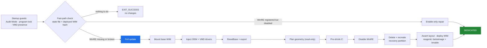

# WinRE Manager

**A self-healing Windows Recovery Environment manager for Windows 10 and 11.**

WinRE Manager is a PowerShell tool that repairs and maintains the **Windows Recovery Environment** (WinRE / Windows RE) on Windows 10 and Windows 11. It detects a broken, disabled, undersized, or missing recovery partition, plans a safe geometry change, rebuilds the recovery image with the correct OEM and VMD drivers, and re-registers it with `reagentc`. It runs on one machine, or as a scheduled SYSTEM task across a managed fleet.

If you landed here searching for **"WinRE is not enabled"**, **"Windows RE is disabled"**, **"Unable to reset, no recovery image"**, **"recovery image not found"**, or **"`reagentc /enable` failed with `0x4c7`"**, jump to [Common problems this fixes](#common-problems-this-fixes).

## Is this for you?

WinRE Manager serves two audiences. Both drive the same control flow.

| You are | You should read |
|---|---|
| **A single-machine user**, repairing your own laptop | [README](../README.md) → run `scripts/WinRE.ps1` once, elevated |
| **An IT admin or sysadmin**, deploying to a managed fleet | [Deployment](deployment.md) → run as `SYSTEM` under a scheduled task |
| **An MSP or sysadmin hosting your own inputs** | [Self-hosting](self-hosting.md) → own manifest, maps, and base WIM |
| **Curious what the script will do** before running it live | [Architecture](architecture.md), then a `-DryRun` pass |

## What it does

The production script runs four control-flow paths — *fast*, *enable-only*, *full update*, *pending-reboot repair* — behind a small set of startup guards. The full-update path is the one that repairs a broken recovery environment.

- **Fast path.** The machine is already in the correct end state. Nothing changes. Exits in seconds.
- **Enable-only.** The image is current, but WinRE is disabled. Prepares the target volume, re-registers the image, calls `reagentc /enable`. No partition work.
- **Full update.** The image is missing or stale, or the partition is wrong-sized. Rebuilds the image, plans the geometry, shrinks C: minimally, replaces the recovery partition, deploys the new image, re-enables WinRE.
- **Pending-reboot repair.** A previous run needed a reboot to complete registration. Retries `reagentc /enable` against the recorded target.

## Common problems this fixes

Each of the following is a real failure mode the tool detects and repairs. If you arrived here searching for one of them, you are in the right place.

- **"Windows RE is disabled" / "WinRE is not enabled".** `reagentc /info` reports `Windows RE status: Disabled`, but the recovery partition and the WIM are present. WinRE Manager runs the enable-only repair — no partition work.
- **"Unable to reset, no recovery image" / "Recovery image not found".** The recovery partition exists, but the WIM inside it is missing, corrupt, or the wrong build. WinRE Manager rebuilds from a known-good base, injects OEM and VMD drivers, and re-deploys the image.
- **A missing or undersized recovery partition.** Some OEM images ship without a dedicated recovery partition, or with one too small for the current WinRE. WinRE Manager plans the geometry, shrinks C: minimally, replaces the partition with a correctly sized one.
- **`reagentc /enable` fails with `0x4c7` (`ERROR_CANCELLED`).** Windows is in Audit Mode, OOBE, or sysprep. WinRE Manager detects this and defers before touching anything.
- **The recovery partition was deleted by another tool.** WinRE Manager detects the missing partition, falls back to `C:\Recovery\WindowsRE` if necessary, and rebuilds the dedicated partition on the next run.
- **Startup Repair or Reset this PC fails on a VMD-based machine.** The deployed WinRE does not include the Intel VMD storage driver, so it cannot see the OS disk. WinRE Manager selects and injects the right VMD package for the machine's CPU generation.
- **Windows Update left the registered WinRE older than the deployed image.** WinRE Manager logs the registered version, the source WIM build, and the deployed WIM build on every run, so build drift is visible in the log.
- **An OEM factory-restore volume carrying the recovery type code.** Recovery-typed partitions over 2 GiB are preserved for operator review — never deleted, never reused.

## Safety by design

- **Idempotent.** A healthy machine takes the fast path. Nothing changes.
- **Targeted.** WinRE is prepared on its **target** volume. C:'s BitLocker state is never changed by the script.
- **Isolated scratch.** Image scratch uses internal fixed NTFS storage only. USB, SD/MMC, network, FireWire, Fibre Channel, unknown-bus disks, and reparse-point workspace paths are excluded.
- **Plan before change.** A read-only geometry plan runs before disabling WinRE or deleting any partition. The plan clamps to the disk-end reserve, enforces a 2 GiB ceiling on managed recovery partitions, and refuses layouts it cannot prove safe.
- **Reversible failure window.** The C: shrink runs *before* `reagentc /disable` and *before* any deletion. A failed pre-shrink leaves the old route intact.
- **Suppress identical retries.** When a pre-shrink deferral is operator-actionable, a sidecar marker suppresses identical retries while the existing route remains verified functional. A staged optimized WIM, if present, lets the eventual successful run skip re-servicing.
- **Fail closed on the destructive sequence.** If the active WinRE route cannot be resolved to a partition, or the OS partition cannot be resolved for the layout assertion, the sequence stops before touching the disk.
- **Single instance.** A kernel-enforced file lock prevents two runs from colliding on the same machine.

## Current release

| Component | Version |
|---|---|
| `scripts/WinRE.ps1` | **v46 patch 2** |
| `scripts/Test-WinRE.ps1` (read-only harness) | **v22** |

**Migration.** The v46 patch 1 `ScriptVersion` bump (45 → 46) updates the `DesiredStateId` and triggers one full update per managed machine on its next run. The v46 patch 2 additions are patch-level only — they do not change the DSI, so a machine already on v46 patch 1 stays on the fast path. Rolling back to v45 also triggers one full update under the older behavior. Full notes are in the [changelog](../CHANGELOG.md).

**Field-testing status.** The v45 destructive path has completed end-to-end on a disposable Hyper-V VM, and the MBR attribute path (`set id=27`) has been exercised on a Win10 MBR VM. The v46 patch 1 plan-clamp fix is field-verified on the Lenovo IdeaPad 3 15IAU7 that motivated it — the plan-rejection corner is documented in [troubleshooting](troubleshooting.md) — and the clean-path v46 destructive pipeline is on record for the Dell Latitude 3540, the HP EliteBook 6 G1i 16", and the HP EliteBook 8 G1i 16". The 8 G1i run is the first field exercise of the v46 patch 2 build-drift log lines and the SD/MMC read guard. The remaining failure paths (post-delete extension fallback, pre-shrink deferrals, the fail-closed C: read refuse branch, shrink retries 2–3, the MBR destructive path, and the post-deletion failure corner) are covered by parser and mocked-geometry tests only. Use a disposable VM for destructive end-to-end exercises before broad deployment.

## Repository tools

- **`scripts/WinRE.ps1`** — the production script. Elevated repair and servicing on a single machine, or as a SYSTEM scheduled task on a fleet.
- **`scripts/Test-WinRE.ps1`** — the read-only test harness. Diagnostics, parser self-tests, and package checks. Safe to run concurrently with production.
- **`scripts/Build-DellWinPEMap.ps1`**, **`scripts/Build-HPWinPEMap.ps1`**, **`scripts/Build-LenovoWinPEMap.ps1`** — optional map-maintenance utilities for teams hosting their own OEM driver maps.

## Full documentation

| You need to… | Start here |
|---|---|
| Inspect a machine without changing it | [Testing](testing.md) |
| Deploy to a managed fleet | [Deployment](deployment.md) |
| Manage your own manifest, maps, or base WIM repository | [Self-hosting](self-hosting.md) |
| Understand what the production script will do | [Architecture](architecture.md) |
| Review disk sizing, workspace selection, or partition replacement | [Recovery partition](recovery-partition.md) |
| Investigate driver selection or failed injection | [Driver injection](driver-injection.md) |
| Interpret state, checkpoints, or retry markers | [State and idempotency](state-and-idempotency.md) |
| Diagnose a warning or failure | [Troubleshooting](troubleshooting.md), then [exit codes](exit-codes.md) |
| Read the release history | [Changelog](../CHANGELOG.md) |

---

*Repository: [github.com/ArthurJDurand/WinRE-Manager](https://github.com/ArthurJDurand/WinRE-Manager) · Docs: [ArthurJDurand.github.io/WinRE-Manager](https://ArthurJDurand.github.io/WinRE-Manager/)*
