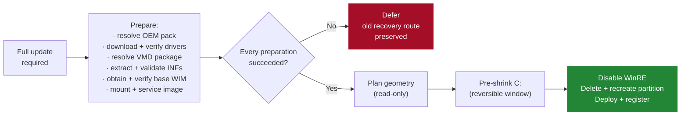

# WinRE Manager

**A self-healing Windows Recovery Environment manager for Windows 10 and 11.**

WinRE Manager repairs, rebuilds, and maintains the **Windows Recovery Environment** (WinRE / Windows RE) on Windows 10 and 11. It services `winre.wim`, injects the OEM and Intel VMD drivers the recovery environment actually needs — including the touchpad and input drivers that let a technician navigate WinRE without a keyboard — verifies the registered recovery route, and keeps the recovery partition correctly sized. It runs on one machine, or as a scheduled SYSTEM task across a managed fleet.

If you landed here searching for **"fix Windows Recovery"**, **"repair Windows Recovery Environment"**, **"fix WinRE"**, **"repair WinRE"**, **"Windows could not find the recovery environment"**, **"The Windows RE image was not found"**, **"Unable to reset, no recovery image"**, or **"`reagentc /enable` failed"**, jump to [What WinRE Manager fixes](#what-winre-manager-fixes).

---

## What WinRE Manager fixes

WinRE Manager exists because "reinstall Windows" is not a repair. Every problem below is a real Windows failure mode where Startup Repair, Reset this PC, or `reagentc` cannot complete — and where the fix is a correctly serviced recovery image on a correctly sized recovery partition, not a new OS.

### The errors you actually see

Each row is an exact error string Windows displays or writes to a log, followed by the underlying cause and what WinRE Manager does about it.

| What you see | Underlying cause | What WinRE Manager does |
|---|---|---|
| **"Windows could not find the recovery environment. Insert your Windows installation or recovery media, and restart your PC with the media."** | WinRE is disabled, or `winre.wim` is missing from wherever `reagentc` points. | Rebuilds the WIM, deploys it, re-registers the recovery route. |
| **"The Windows RE image was not found."** (`REAGENTC.EXE: The Windows RE image was not found`) | The recovery partition exists, but `winre.wim` inside it is absent, corrupt, or the wrong build. | Services a fresh image, verifies it by SHA256, deploys it, re-enables. |
| **"Unable to reset, no recovery image."** | Reset this PC cannot find a bootable WinRE image to hand off to. | Restores the image and re-enables WinRE so Reset and Startup Repair work again. |
| **"Could not find the recovery environment"** when starting Advanced startup | `reagentc` is registered to a partition or path that no longer exists. | Classifies the current route, rebuilds the image, restores registration. |
| **"Windows RE status: Disabled"** in `reagentc /info` | The recovery image is present but not registered. | Runs the enable-only path: prepares the target volume, re-registers, calls `reagentc /enable`. No partition work, no rebuild. |
| **`REAGENTC.EXE: Operation failed: b7`** | `reagentc /enable` cannot create a BCD entry, usually after a disk layout change. | Rebuilds the recovery partition geometry, applies the correct type code, re-registers cleanly. |
| **`REAGENTC.EXE: Unable to update Boot Configuration Data`** | The BCD store is inconsistent with the actual recovery partition. | Repairs registration and asserts the whole layout before re-enabling. |
| **`reagentc /enable` fails with `0x4c7` (`ERROR_CANCELLED`)** | Windows is in Audit Mode, OOBE, or sysprep. | Detects this and defers before touching anything, then completes after OOBE. |
| **`reagentc /enable` fails with `0x80070005` (Access Denied)** | The recovery partition has no accessible path, or a security descriptor is blocking it. | Assigns a temporary drive letter, prepares the volume, re-registers. |
| **Recovery partition too small after Windows Update** (`KB5034441`, `0x80070643`) | The recovery partition cannot hold the serviced SafeOS image. | Replaces it with a correctly sized partition — actual WIM size plus the Microsoft 250 MiB servicing margin — then re-deploys. |
| **"Startup Repair cannot repair this computer automatically"** | The deployed WinRE lacks the storage-controller driver the machine needs, so it cannot see the OS disk. | Selects and injects the correct VMD package for the machine's CPU generation. See the next section. |

### Input and navigation drivers — so WinRE is *usable*, not just present

A recovery environment that boots but cannot be navigated is barely a recovery environment. WinRE Manager injects the drivers that let a person actually use WinRE, and that let WinRE actually see the OS disk.

- **Touchpad and input drivers.** OEM WinPE packs (Dell, HP, Lenovo) include the touchpad, keyboard, and input-controller drivers for the vendor's hardware. WinRE Manager resolves the correct OEM pack for the machine's model and injects it — so a technician on an HP consumer laptop can navigate WinRE with the touchpad instead of hunting for a USB keyboard.
- **Intel VMD storage drivers.** On 12th-generation Intel and later laptops — including the HP 15 series, which is the machine that has driven the most support tickets — Startup Repair and Reset this PC fail with `INACCESSIBLE_BOOT_DEVICE` unless the deployed WinRE includes the VMD driver. WinRE Manager detects VMD presence on the machine, resolves the right driver package for the CPU generation, and injects it.
- **OEM WinPE packs, resolved per-machine.** Dell, HP, and Lenovo publish WinPE driver packs for their business models. WinRE Manager reads the machine type, resolves the correct pack, downloads and extracts it with the vendor's own extractor, and injects the applicable INFs.
- **Injection verified, not assumed.** `Add-WindowsDriver`'s return shape is unreliable across DISM builds. WinRE Manager judges injection success by third-party driver-count delta plus an INF-basename cross-reference between the extracted package and the mounted image — the same method the harness uses to diagnose a failed injection after the fact.

### Recovery partition geometry — the right size, in the right place, on the right disk

- **A missing recovery partition.** Some OEM images ship without one. WinRE Manager plans a replacement geometry, shrinks C: by the minimum required, and creates a dedicated recovery partition on the aligned boundary.
- **An undersized recovery partition.** If the existing partition cannot hold the serviced WIM plus Microsoft's 250 MiB servicing margin, WinRE Manager replaces it. A partition that cannot meet the margin will fail the next Windows Update — accepting it would be worse than replacing it.
- **A recovery partition on a non-OS disk.** A stray type-coded recovery partition on a secondary disk can cause Startup Repair to point the BCD at the wrong image. WinRE Manager removes type-coded recovery partitions from non-OS disks.
- **An OEM factory-restore volume carrying the recovery type code.** Recovery-typed partitions over 2 GiB are preserved for operator review — never deleted, never reused. Windows Setup recovery partitions are under 1.5 GiB; OEM factory volumes can be 7–20 GiB and may carry the same type code.

### Build drift and stale images — Windows Update moves, WinRE Manager tracks

- **Windows Update leaves the registered WinRE newer than the deployed one.** WinRE Manager logs the registered WinRE version, the source WIM build, and the post-deploy WIM build on every run, so build drift is visible across the fleet.
- **Hardware or deployment inputs changed** — a CPU swap, a BIOS VMD flip, or a Windows build change. WinRE Manager recomputes the deployment identity (`DesiredStateId`) and rebuilds the WIM against the new inputs.
- **OEM pack or driver manifest version bumped.** The deployment identity changes and the machine rebuilds once. Healthy machines on the same inputs stay on the fast path.

---

## Who it's for

Two audiences. Both drive the same control flow.

| You are | You should read |
|---|---|
| **A single-machine user**, repairing your own laptop | [README](../README.md) → run `scripts/WinRE.ps1` once, elevated |
| **An IT admin or sysadmin**, deploying to a managed fleet | [Deployment](deployment.md) → run as `SYSTEM` under a scheduled task |
| **An MSP or sysadmin hosting your own inputs** | [Self-hosting](self-hosting.md) → own manifest, maps, and base WIM |
| **Curious what the script will do** before running it live | [Architecture](architecture.md), then a `-DryRun` pass |

---

## Design principles

WinRE Manager's design is organized around four rules, in this order — see [Architecture](architecture.md) for the full hierarchy, the enforcement tables, and the reasoning behind each.

1. **Never break Windows RE.**
2. **Never leave a machine without a working recovery route** — to the extent the machine, its OS, and its storage stack allow.
3. **Minimize the `reagentc /disable` → `reagentc /enable` window.**
4. **Do no work unless needed. When work is needed, prepare everything before touching anything.**

Rules 1–3 are **invariants**: no code change may weaken them. Rule 4 is the **working rule** — the discipline by which rules 1–3 are enforced on the fast path, the enable-only path, and the destructive path.

### Rule 4 in practice: no work unless needed

Rule 4 has three tiers of work. A healthy machine takes Tier 1; a machine with an enable-only repair takes Tier 2; only a machine that needs a full update takes Tier 3.

**Tier 1 — nothing to do.** Fast path. Health checks pass, the state file matches the current inputs, the image is current, the partition is correct. The run exits in under a second. No WIM is mounted, no partition is touched, no `reagentc` call is made.

**Tier 2 — minimal work.** Enable-only repair. The image is current, but WinRE is disabled. The script prepares the target recovery partition, re-registers the image, and calls `reagentc /enable`. No partition geometry change, no image rebuild, no C: shrink.

**Tier 3 — full update.** The image is missing, stale, or the recovery partition is wrong-sized. This is the only path that does destructive work.

**Even on Tier 3, the work is conditional and ordered.** Before the first byte of the recovery partition is touched, every preparation must complete:

If driver download fails, or OEM pack extraction produces zero INFs, or the VMD package cannot be resolved for the CPU generation, or the base WIM cannot be verified — **the script stops before it touches the recovery partition.** The old recovery route stays intact. Nothing is destroyed in the service of a rebuild that could not have succeeded anyway.

### Drivers go into a clean base

The recovery image on a machine that has ever run the script carries *our* previously injected OEM and VMD drivers. Before new drivers are injected, the image is normalised so the injection targets a clean baseline, not a stale one with our own prior layers still present. This is what makes the deployment identity — `DesiredStateId` — a reliable fingerprint of the image contents, not just of the inputs that produced them.

---

## Safety by design

- **Idempotent.** A healthy machine takes the fast path. Nothing changes.
- **Plan before change.** A read-only geometry plan runs before disabling WinRE or deleting any partition. The plan clamps to the disk-end reserve, enforces a 2 GiB ceiling on managed recovery partitions, and refuses layouts it cannot prove safe.
- **Reversible failure window.** The C: shrink runs *before* `reagentc /disable` and *before* any deletion. A failed pre-shrink leaves the old recovery route intact.
- **Fail closed on the destructive sequence.** If the active WinRE route cannot be resolved to a partition, or the OS partition cannot be resolved for the layout assertion, the sequence stops before touching the disk.
- **Targeted.** WinRE is prepared on its **target** volume. C:'s BitLocker state is never changed by the script.
- **Isolated scratch.** Image scratch uses internal fixed NTFS storage only. USB, SD/MMC, network, FireWire, Fibre Channel, unknown-bus disks, and reparse-point workspace paths are excluded.
- **Suppress identical retries.** When a pre-shrink deferral is operator-actionable, a sidecar marker suppresses identical retries while the existing route remains verified functional. A staged optimized WIM, if present, lets the eventual successful run skip re-servicing.
- **Single instance.** A kernel-enforced file lock prevents two runs from colliding on the same machine.

---

## Current release

| Component | Version |
|---|---|
| `scripts/WinRE.ps1` | **v46 patch 2** |
| `scripts/Test-WinRE.ps1` (read-only harness) | **v22** |

**Migration.** The v46 patch 1 `ScriptVersion` bump (45 → 46) updates the `DesiredStateId` and triggers one full update per managed machine on its next run. The v46 patch 2 additions are patch-level only — they do not change the DSI, so a machine already on v46 patch 1 stays on the fast path. Rolling back to v45 also triggers one full update under the older behavior. Full notes are in the [changelog](../CHANGELOG.md).

**Field-testing status.** The v45 destructive path has completed end-to-end on a disposable Hyper-V VM, and the MBR attribute path (`set id=27`) has been exercised on a Win10 MBR VM. The v46 patch 1 plan-clamp fix is field-verified on the Lenovo IdeaPad 3 15IAU7 that motivated it — the plan-rejection corner is documented in [troubleshooting](troubleshooting.md) — and the clean-path v46 destructive pipeline is on record for the Dell Latitude 3540, the HP EliteBook 6 G1i 16", and the HP EliteBook 8 G1i 16". The 8 G1i run is the first field exercise of the v46 patch 2 build-drift log lines and the SD/MMC read guard. The remaining failure paths (post-delete extension fallback, pre-shrink deferrals, the fail-closed C: read refuse branch, shrink retries 2–3, the MBR destructive path, and the post-deletion failure corner) are covered by parser and mocked-geometry tests only. Use a disposable VM for destructive end-to-end exercises before broad deployment.

---

## Repository tools

- **`scripts/WinRE.ps1`** — the production script. Elevated repair and servicing on a single machine, or as a SYSTEM scheduled task on a fleet.
- **`scripts/Test-WinRE.ps1`** — the read-only test harness. Diagnostics, parser self-tests, and package checks. Safe to run concurrently with production.
- **`scripts/Build-DellWinPEMap.ps1`**, **`scripts/Build-HPWinPEMap.ps1`**, **`scripts/Build-LenovoWinPEMap.ps1`** — optional map-maintenance utilities for teams hosting their own OEM driver maps.

---

## Full documentation

| You need to… | Start here |
|---|---|
| Inspect a machine without changing it | [Testing](testing.md) |
| Deploy to a managed fleet | [Deployment](deployment.md) |
| Manage your own manifest, maps, or base WIM repository | [Self-hosting](self-hosting.md) |
| Understand what the production script will do | [Architecture](architecture.md) |
| Review disk sizing, workspace selection, or partition replacement | [Recovery partition](recovery-partition.md) |
| Investigate driver selection or failed injection | [Driver injection](driver-injection.md) |
| Interpret state, checkpoints, or retry markers | [State and idempotency](state-and-idempotency.md) |
| Diagnose a warning or failure | [Troubleshooting](troubleshooting.md), then [exit codes](exit-codes.md) |
| Read the release history | [Changelog](../CHANGELOG.md) |

---

*Repository: [github.com/ArthurJDurand/WinRE-Manager](https://github.com/ArthurJDurand/WinRE-Manager) · Docs: [ArthurJDurand.github.io/WinRE-Manager](https://ArthurJDurand.github.io/WinRE-Manager/)*
