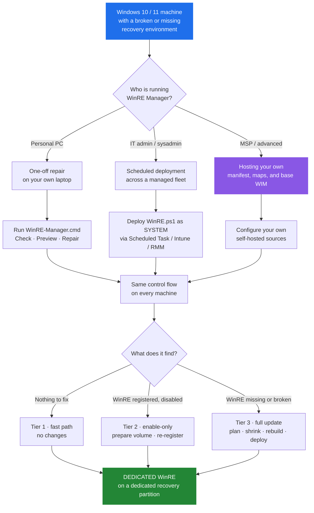

# WinRE Manager

**Repair and rebuild the Windows Recovery Environment (WinRE) on Windows 10 and 11.**

WinRE Manager services `winre.wim`, injects the OEM and Intel VMD drivers the recovery environment needs, verifies the registered recovery route, and keeps the recovery partition correctly sized. Safe to re-run: a machine that needs no work takes an idempotent fast path that mounts no WIM, touches no partition, and does not disable, re-register, or enable WinRE. Runs on one machine, or as a scheduled SYSTEM task across a managed fleet.

---

## What do you need?

| I want to… | Start here |
|---|---|
| **Fix WinRE on my own PC** | [Quick start (README)](https://github.com/ArthurJDurand/WinRE-Manager/blob/main/README.md#just-want-to-fix-winre-on-your-pc) — download, extract, double-click `WinRE-Manager.cmd`. No PowerShell knowledge required. |
| **Check my PC without changing anything** | [Testing](testing.md) — the read-only harness. |
| **See what the repair would do before running it** | Run `WinRE-Manager.cmd` and pick **Option 2 — Preview**. |
| **Deploy to a managed fleet** | [Deployment](deployment.md) — scheduled task XML, Intune, RMM. |
| **Host my own manifest, maps, or base WIM** | [Self-hosting](self-hosting.md). |
| **Understand how it works** | [Architecture](architecture.md) — the four invariants and the pipeline. |
| **Fix a specific error** | [Troubleshooting](troubleshooting.md) — log signatures and operator recovery steps. |
| **Read the release history** | [Changelog](https://github.com/ArthurJDurand/WinRE-Manager/blob/main/CHANGELOG.md). |

---

## Common Windows Recovery problems

If Windows is telling you something is wrong with the recovery environment, find the message below and start there.

| Problem | Start here |
|---|---|
| Windows says it cannot find the recovery environment | [Troubleshooting](troubleshooting.md) |
| `The Windows RE image was not found` | [Troubleshooting](troubleshooting.md) |
| `reagentc /enable` fails or `reagentc /info` reports **Disabled** | [Troubleshooting](troubleshooting.md) |
| Windows Update reports `0x80070643` (recovery partition too small) | [Recovery partition](recovery-partition.md) |
| Startup Repair cannot repair the computer automatically | [Driver injection](driver-injection.md) |
| You want to inspect the machine without changing anything | [Testing](testing.md) |

The full error-by-error matrix — exact strings, causes, and what WinRE Manager does — is in the [README](https://github.com/ArthurJDurand/WinRE-Manager/blob/main/README.md#what-winre-manager-fixes).

---

## Who is this for?

Three audiences. All drive the same control flow on every machine.

| You are | You should read |
|---|---|
| **A single-machine user**, repairing your own laptop | [Quick start](https://github.com/ArthurJDurand/WinRE-Manager/blob/main/README.md#just-want-to-fix-winre-on-your-pc) — download, extract, double-click `WinRE-Manager.cmd` |
| **An IT admin or sysadmin**, deploying to a managed fleet | [Deployment](deployment.md) — run as `SYSTEM` under a scheduled task |
| **An MSP or sysadmin hosting your own inputs** | [Self-hosting](self-hosting.md) — own manifest, OEM maps, and base WIM repository |
| **Curious what the script will do** before running it live | [Architecture](architecture.md), then a `-DryRun` pass |

---

## The four design principles

Every decision in the codebase follows these four rules, in this order:

1. **Never break Windows RE.**
2. **Never leave a machine without a working recovery route** — to the extent the machine, its OS, and its storage stack allow.
3. **Minimize the `reagentc /disable` → `reagentc /enable` window.**
4. **Do no work unless needed. When work is needed, prepare everything before touching anything.**

Rules 1–3 are **invariants**: no code change may weaken them. Rule 4 is the **working rule** — the discipline by which rules 1–3 are enforced on the fast path, the enable-only path, and the destructive path. Full hierarchy, enforcement tables, and reasoning: **[Architecture](architecture.md)**.

---

## Safety by design

The destructive path is surrounded by protections implemented in the code rather than relying on operator assumptions. Each of the following is enforced by the software, not left to operator discretion.

- **Idempotent fast path.** A healthy machine exits without mounting a WIM, touching a partition, or issuing a `reagentc` mutation.
- **Plan before change.** A read-only geometry plan runs before WinRE is disabled or any partition is deleted, and refuses layouts it cannot prove safe.
- **Reversible failure window.** The C: pre-shrink runs before `reagentc /disable` and before any deletion. A failed pre-shrink leaves the old route intact.
- **Fail closed on the destructive sequence.** If the active WinRE route or the OS partition cannot be resolved, the sequence stops before touching the disk.
- **Transactional WIM replacement (v48).** The active route's WIM is preserved as a rollback copy before the new one is staged; on any copy failure the previous WIM is restored and hash-verified.
- **Targeted.** WinRE is prepared on its *target* volume. C:'s BitLocker state is never modified.
- **Isolated workspace.** Scratch uses internal fixed NTFS volumes only; USB, SD/MMC, network, and unknown-bus disks are excluded.
- **Single instance.** A kernel-enforced file lock prevents two runs from colliding.
- **Architecture gate (v48).** The manager refuses to run on any architecture other than x64, before any state mutation.
- **Elevation guard (v48 patch 2).** An unelevated launch is refused in milliseconds with a clear message.

Full safety model: **[Architecture](architecture.md)** and **[Recovery partition](recovery-partition.md)**.

---

## Three tiers of work

| Tier | When | What happens |
|---|---|---|
| **Tier 1 — fast path** | The machine is healthy. | No WIM is mounted, no partition is touched, no `reagentc` mutation is issued. Runtime is dominated by Windows' own CIM and PnP enumeration. |
| **Tier 2 — enable-only** | The image is current, but WinRE is disabled. | The target recovery partition is prepared, the image is re-registered, and `reagentc /enable` is called. No partition geometry change, no image rebuild, no C: shrink. |
| **Tier 3 — full update** | The image is missing, stale, or the recovery partition is wrong-sized. | The only path that may perform destructive partition changes. Every preparation — OEM pack, VMD package, base WIM, strip stage, injection, export — completes **before** the first byte of the recovery partition is touched. If any preparation fails, the script stops and the old recovery route is preserved. |

Full pipeline, checkpoints, and the state model: **[Architecture](architecture.md)** and **[State and idempotency](state-and-idempotency.md)**.

---

## What WinRE Manager fixes

WinRE Manager exists because "reinstall Windows" is not a repair. The full error-by-error matrix — the exact error strings, the underlying cause, and what WinRE Manager does — is in the [README](https://github.com/ArthurJDurand/WinRE-Manager/blob/main/README.md#what-winre-manager-fixes). The failure classes:

- **Recovery environment not found.** WinRE disabled, or `winre.wim` missing from wherever `reagentc` points.
- **"The Windows RE image was not found."** `winre.wim` absent, corrupt, or the wrong build.
- **`reagentc /enable` failures.** BCD inconsistencies, access-denied paths, Audit Mode / OOBE / sysprep states.
- **Recovery partition too small.** The partition cannot hold the serviced SafeOS image plus Microsoft's 250 MiB servicing margin. Frequently surfaced by Windows Update as `0x80070643` — the well-known example is the Windows 10 update KB5034441; the underlying failure is not KB-specific.
- **"Startup Repair cannot repair this computer automatically."** The deployed WinRE lacks the storage-controller driver the machine needs.
- **Missing or mis-sized recovery partition geometry.** Missing partition, undersized partition, recovery partition on a non-OS disk, recovery partition separated from C: by a data partition (v48 intervening-anchor path).

Detailed write-ups:

| Failure class | Guide |
|---|---|
| Missing or corrupted `winre.wim`, disabled WinRE | [Troubleshooting](troubleshooting.md) |
| Partition sizing and geometry | [Recovery partition](recovery-partition.md) |
| OEM / VMD driver selection and injection | [Driver injection](driver-injection.md) |
| Build drift, stale images, deployment identity | [State and idempotency](state-and-idempotency.md) |
| Exit codes and orchestration | [Exit codes](exit-codes.md) |

---

## Documentation

| Guide | Use it for |
|---|---|
| [Deployment](deployment.md) | Scheduled tasks, MDM, fleet rollout, and deployment-time translations of the four design invariants |
| [Self-hosting](self-hosting.md) | Replacing the manifest, OEM maps, and base WIM repository with your own hosting |
| [Architecture](architecture.md) | The four design invariants, the pipeline, the control-flow invariants, and the state-carrying artifacts |
| [Recovery partition](recovery-partition.md) | Sizing, geometry planning, replacement behavior |
| [Driver injection](driver-injection.md) | OEM/VMD selection, downloads, validation, and the third-party driver strip stage |
| [State and idempotency](state-and-idempotency.md) | `DesiredStateId`, checkpoints, deployment state, deferral sidecar |
| [Testing](testing.md) | Read-only harness and recommended regression checks |
| [Troubleshooting](troubleshooting.md) | Log signatures and operator recovery steps |
| [Exit codes](exit-codes.md) | Full exit-code matrix and orchestration policy |
| [Changelog](https://github.com/ArthurJDurand/WinRE-Manager/blob/main/CHANGELOG.md) | Release history and per-machine field evidence |

---

## Current release

| Component | Version |
|---|---|
| `scripts/WinRE.ps1` | **v48 patch 2** |
| `scripts/Test-WinRE.ps1` (read-only harness) | **v27** |
| `scripts/WinRE-Manager.cmd` | (interactive wrapper; ships with the release) |

**v48 patch 1** raised `ScriptVersion` from 47 to 48, so every managed machine performs one full-update pass on its next scheduled run, then returns to the fast path. **v48 patch 2** kept `ScriptVersion` at 48 and added a fail-fast elevation guard and a source-WIM hash cache; a machine already on v48 patch 1 continues on the fast path. Full release notes, migration steps, and per-machine field evidence: **[Changelog](https://github.com/ArthurJDurand/WinRE-Manager/blob/main/CHANGELOG.md)**.

---

## Requirements at a glance

- Windows 10 (build 19041+) or Windows 11 (build 22000+). Windows 11 24H2 and 25H2 explicitly supported.
- PowerShell 5.1 or 7.x.
- x64 OS architecture. ARM64 support is not claimed.
- Elevation or SYSTEM for production. The read-only harness runs unelevated.
- 7-Zip at `C:\Program Files\7-Zip\7z.exe` (installed via `winget` if missing).
- Internet access on first deployment. Offline after the first successful run on a machine whose state file is present and whose local safety checks pass.

Full requirements and caveats: [README § Requirements](https://github.com/ArthurJDurand/WinRE-Manager/blob/main/README.md#requirements).

---

## Field-tested hardware

Selected results. Full per-machine evidence: [Changelog](https://github.com/ArthurJDurand/WinRE-Manager/blob/main/CHANGELOG.md).

| Vendor | Model | OS | Result |
|---|---|---|---|
| ASUS | PRIME H510M-D (i5-11400) | Win11 26300 | v47 patch 1 — clean non-destructive migration from v46 |
| AB8139 (DMI) | LX15PRO (Ryzen 7 5825U) | Win11 26300 | **v48 patch 1** — first field validation of the intervening-anchor path on the exact `C: \| D: \| Recovery` layout that motivated it |
| Dell | Pro Max 16 Premium MA16250 (Core Ultra 7 265H) | Win11 26300 | v47 patch 2 — full rebuild with Dell WinPE11 A10 OEM pack; 64 drivers injected |
| ASUS | Vivobook X1504ZA (i3-1215U) | Win11 26300 | v47 patch 2 — C: actively encrypting at 91% during run; dedicated-partition path completed |
| HP | EliteBook 8 G1i 16" (Core Ultra 5 235U) | Win11 26300 | v46 patch 2 — clean destructive rebuild |
| Lenovo | IdeaPad 3 15IAU7 (MT 82RK) | Win11 26200 | v46 patch 1 — the machine that motivated the plan-clamp fix |
| (VM) | Hyper-V Win11 / Win10 MBR | Win11 26300 / Win10 19045 | v45 patch 1 — destructive path and MBR partition-attribute path verified end-to-end |

The v44 patch 7 destructive path is field-verified on encrypted C: across eight distinct physical machines. The remaining coverage gaps — post-deletion failure on the intervening-anchor path, the v48 multi-intervening and surplus rejections, the transactional-WIM rollback branch, and the architecture gate on ARM64 — are documented in [Testing](testing.md).

---

## Repository

- **Repository:** [github.com/ArthurJDurand/WinRE-Manager](https://github.com/ArthurJDurand/WinRE-Manager)
- **Releases:** [github.com/ArthurJDurand/WinRE-Manager/releases/latest](https://github.com/ArthurJDurand/WinRE-Manager/releases/latest)
- **Bug reports / discussion:** [GitHub Discussions](https://github.com/ArthurJDurand/WinRE-Manager/discussions)
- **Security:** [SECURITY.md](https://github.com/ArthurJDurand/WinRE-Manager/blob/main/SECURITY.md) — do not file public issues for vulnerabilities.
- **Contributing:** [CONTRIBUTING.md](https://github.com/ArthurJDurand/WinRE-Manager/blob/main/CONTRIBUTING.md)
- **Sponsor:** [github.com/sponsors/ArthurJDurand](https://github.com/sponsors/ArthurJDurand)
- **License:** MIT — see [LICENSE](https://github.com/ArthurJDurand/WinRE-Manager/blob/main/LICENSE).

---

*Repository: [github.com/ArthurJDurand/WinRE-Manager](https://github.com/ArthurJDurand/WinRE-Manager) · Docs: [ArthurJDurand.github.io/WinRE-Manager](https://ArthurJDurand.github.io/WinRE-Manager/)*
