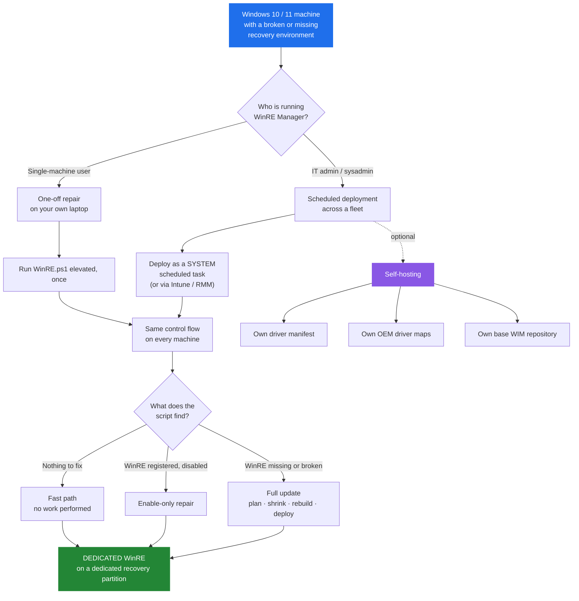
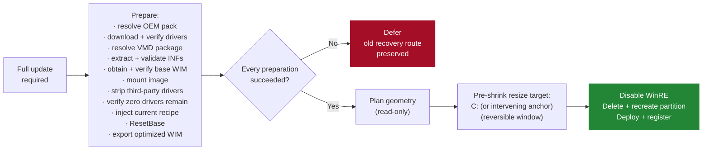

# WinRE Manager

**A self-healing Windows Recovery Environment manager for Windows 10 and 11.**

[](https://ArthurJDurand.github.io/WinRE-Manager/)
[](../CHANGELOG.md)
[](../README.md)
[](../README.md)

WinRE Manager repairs, rebuilds, and maintains the **Windows Recovery Environment** (WinRE / Windows RE) on Windows 10 and 11. It services `winre.wim`, injects the OEM and Intel VMD drivers the recovery environment actually needs — including the touchpad and input drivers that let a technician navigate WinRE without a keyboard — verifies the registered recovery route, and keeps the recovery partition correctly sized. It runs on one machine, or as a scheduled SYSTEM task across a managed fleet.

If you landed here searching for **"fix Windows Recovery"**, **"repair Windows Recovery Environment"**, **"fix WinRE"**, **"repair WinRE"**, **"Windows could not find the recovery environment"**, **"The Windows RE image was not found"**, **"Unable to reset, no recovery image"**, **"recovery image not found"**, **"`reagentc /enable` failed"**, **"recovery partition too small after KB5034441"**, **"0x80070643"**, **"reagentc failed to enable"**, or **"Startup Repair cannot repair this computer automatically"**, jump to [What WinRE Manager fixes](#what-winre-manager-fixes).

---

## Quick Start

The recommended path is the interactive wrapper, `scripts\WinRE-Manager.cmd`. If you want to drive the PowerShell scripts directly — for scripting, CI, or a pinned version — see [Advanced usage](#advanced-usage).

### Step 1 — Get the scripts

Clone the repository:

```powershell
git clone https://github.com/ArthurJDurand/WinRE-Manager.git
```

Or download the latest release from [github.com/ArthurJDurand/WinRE-Manager/releases/latest](https://github.com/ArthurJDurand/WinRE-Manager/releases/latest) and unpack the archive.

The scripts you will actually run live in the `scripts\` folder:

- `scripts\WinRE-Manager.cmd` — the interactive wrapper (recommended)
- `scripts\WinRE.ps1` — the production script (invoked by the wrapper)
- `scripts\Test-WinRE.ps1` — the read-only diagnostic harness

### Step 2 — Run the wrapper

From File Explorer, open the `scripts\` folder and double-click **`WinRE-Manager.cmd`**. The wrapper opens the menu in the current console without asking for elevation. When you pick an action that needs Administrator rights, a UAC prompt appears and the selected PowerShell script runs elevated in a new window; the menu stays open behind it.

The wrapper menu appears with these options:

| Option | What it does |
|---|---|
| **1** Test harness | Read-only diagnostics and self-tests. Makes no changes to partitions, WinRE, BitLocker, or state. |
| **2** Preview (DryRun) | Walks the full production flow and prints every decision it would make — without shrinking, deleting, creating, formatting, or deploying anything. |
| **3** Run for real | The actual repair. Warns you first, requires you to type `RUN` to confirm, then does the work. |
| **4** Show recent log | Prints the tail of the last run's log and offers to open it in Notepad. |
| **5** Quit | Closes the wrapper. |

The wrapper does not request elevation at startup. The menu is unelevated, and elevation is requested only for the action you pick: the selected PowerShell script runs elevated in a new window, and the menu remains open behind it.

> **Why the wrapper, not a direct script invocation?** The wrapper keeps the menu open so you can run several operations in sequence without re-launching, gives you a chance to abort at any point before anything destructive happens, and elevates only the specific PowerShell script that needs it. The production script has its own fail-fast elevation guard for the case where it is invoked directly — but the wrapper is the recommended path for everyone.

---

## Advanced usage

### Direct PowerShell invocation

From the repository root, in an elevated PowerShell:

```powershell
powershell -ExecutionPolicy Bypass -File .\scripts\Test-WinRE.ps1          # read-only, unelevated
powershell -ExecutionPolicy Bypass -File .\scripts\WinRE.ps1 -DryRun       # elevated
powershell -ExecutionPolicy Bypass -File .\scripts\WinRE.ps1               # elevated
```

The test harness runs unelevated; the production script needs elevation or SYSTEM.

### One-liners (no local clone)

Runs the script in your current session — including its final `exit` — so this form is convenient for a quick diagnostic but not for anything you need `$LASTEXITCODE` from.

```powershell
Invoke-RestMethod -Uri 'https://raw.githubusercontent.com/ArthurJDurand/WinRE-Manager/main/scripts/Test-WinRE.ps1' -UseBasicParsing | Invoke-Expression
```

**`Invoke-Expression` cannot pass parameters.** For `WinRE.ps1` with `-DryRun` or any other switch, use the scriptblock form. Same current-session caveat, but the arguments work:

```powershell
& ([scriptblock]::Create((irm 'https://raw.githubusercontent.com/ArthurJDurand/WinRE-Manager/main/scripts/WinRE.ps1' -UseBasicParsing))) -DryRun
```

The save-and-run form is preferable for anything you care about: it isolates the script in a child process, keeps your shell open, and exposes `$LASTEXITCODE`:

```powershell
$p = "$env:TEMP\WinRE.ps1"
Invoke-RestMethod -Uri 'https://raw.githubusercontent.com/ArthurJDurand/WinRE-Manager/main/scripts/WinRE.ps1' -UseBasicParsing -OutFile $p
powershell -ExecutionPolicy Bypass -File $p -DryRun
```

> **Execution policy note.** The `-ExecutionPolicy Bypass` flag applies only to the child process running the script; it does not change your machine's execution policy. If you run a downloaded script directly (`& $p` or `.\script.ps1`), your policy may block it.

> **Trust note.** Downloading a script from the internet and executing it is convenient but you should be comfortable with the source. The URLs above all point to the project's own GitHub repository at `raw.githubusercontent.com/ArthurJDurand/WinRE-Manager`, over HTTPS. If you prefer, clone the repo and run the local copy — the code is identical. Pin a release tag for anything you deploy broadly.

### Reproducible runs (pinned version)

`main` tracks the current release. For a fixed, reproducible version, replace `main` with a release tag — `v48.2` for the current v48 patch 2 release:

```powershell
$p = "$env:TEMP\WinRE.ps1"
Invoke-RestMethod -Uri 'https://raw.githubusercontent.com/ArthurJDurand/WinRE-Manager/v48.2/scripts/WinRE.ps1' -UseBasicParsing -OutFile $p
powershell -ExecutionPolicy Bypass -File $p -DryRun
```

### Fleet deployment

Run `WinRE.ps1` as `NT AUTHORITY\SYSTEM` on a scheduled task triggered at boot and weekly. Ready-to-paste task XML and MDM guidance are in [Deployment](deployment.md).

> **Elevated** means an administrator PowerShell prompt — the current user with the Administrator token. **As SYSTEM** means running under the built-in `NT AUTHORITY\SYSTEM` account, which is how a scheduled task is configured. Production needs one or the other. The test harness needs neither.

---

## What WinRE Manager fixes

WinRE Manager exists because "reinstall Windows" is not a repair. Every problem below is a real Windows failure mode where Startup Repair, Reset this PC, or `reagentc` cannot complete — and where the fix is a correctly serviced recovery image on a correctly sized recovery partition, not a new OS.

### The errors you actually see

Each row is an exact error string Windows displays or writes to a log, followed by the underlying cause and what WinRE Manager does about it.

| What you see | Underlying cause | What WinRE Manager does |
|---|---|---|
| **"Windows could not find the recovery environment. Insert your Windows installation or recovery media, and restart your PC with the media."** | WinRE is disabled, or `winre.wim` is missing from wherever `reagentc` points. | Rebuilds the WIM, deploys it, re-registers the recovery route. |
| **"The Windows RE image was not found."** (`REAGENTC.EXE: The Windows RE image was not found`) | The recovery partition exists, but `winre.wim` inside it is absent, corrupt, or the wrong build. | Services a fresh image, verifies it by SHA256, deploys it, re-enables. |
| **"Unable to reset, no recovery image."** | Reset this PC cannot find a bootable WinRE image to hand off to. | Restores the image and re-enables WinRE so Reset and Startup Repair work again. |
| **"Could not find the recovery environment"** when starting Advanced startup | `reagentc` is registered to a partition or path that no longer exists. | Classifies the current route, rebuilds the image, restores registration. |
| **"Windows RE status: Disabled"** in `reagentc /info` | The recovery image is present but not registered. | Runs the enable-only path: prepares the target volume, re-registers, calls `reagentc /enable`. No partition work, no rebuild. |
| **`REAGENTC.EXE: Operation failed: b7`** | `reagentc /enable` cannot create a BCD entry, usually after a disk layout change. | Rebuilds the recovery partition geometry, applies the correct type code, re-registers cleanly. |
| **`REAGENTC.EXE: Unable to update Boot Configuration Data`** | The BCD store is inconsistent with the actual recovery partition. | Repairs registration and asserts the whole layout before re-enabling. |
| **`reagentc /enable` fails with `0x4c7` (`ERROR_CANCELLED`)** | Windows is in Audit Mode, OOBE, or sysprep. | Detects this and defers before touching anything, then completes after OOBE. |
| **`reagentc /enable` fails with `0x80070005` (Access Denied)** | The recovery partition has no accessible path, or a security descriptor is blocking it. | Assigns a temporary drive letter, prepares the volume, re-registers. |
| **Recovery partition too small after Windows Update** (`KB5034441`, `0x80070643`) | The recovery partition cannot hold the serviced SafeOS image. | Replaces it with a correctly sized partition — actual WIM size plus the Microsoft 250 MiB servicing margin — then re-deploys. |
| **"Startup Repair cannot repair this computer automatically"** | The deployed WinRE lacks the storage-controller driver the machine needs, so it cannot see the OS disk. | Selects and injects the correct VMD package for the machine's CPU generation. See the next section. |

### Input and navigation drivers — so WinRE is *usable*, not just present

A recovery environment that boots but cannot be navigated is barely a recovery environment. WinRE Manager injects the drivers that let a person actually use WinRE, and that let WinRE actually see the OS disk.

- **Touchpad and input drivers.** OEM WinPE packs (Dell, HP, Lenovo) include the touchpad, keyboard, and input-controller drivers for the vendor's hardware. WinRE Manager resolves the correct OEM pack for the machine's model and injects it — so a technician on an HP consumer laptop can navigate WinRE with the touchpad instead of hunting for a USB keyboard.
- **Intel VMD storage drivers.** On 12th-generation Intel and later laptops — including the HP 15 series, which is the machine that has driven the most support tickets — Startup Repair and Reset this PC fail with `INACCESSIBLE_BOOT_DEVICE` unless the deployed WinRE includes the VMD driver. WinRE Manager detects VMD presence on the machine, resolves the right driver package for the CPU generation, and injects it.
- **OEM WinPE packs, resolved per-machine.** Dell, HP, and Lenovo publish WinPE driver packs for their business models. WinRE Manager reads the machine type, resolves the correct pack, downloads and extracts it with the vendor's own extractor, and injects the applicable INFs.
- **Injection verified, not assumed.** `Add-WindowsDriver`'s return shape is unreliable across DISM builds. WinRE Manager judges injection success by third-party driver-count delta plus an INF-basename cross-reference between the extracted package and the mounted image — the same method the harness uses to diagnose a failed injection after the fact.

### Recovery partition geometry — the right size, in the right place, on the right disk

- **A missing recovery partition.** Some OEM images ship without one. WinRE Manager plans a replacement geometry, shrinks C: by the minimum required, and creates a dedicated recovery partition on the aligned boundary.
- **An undersized recovery partition.** If the existing partition cannot hold the serviced WIM plus Microsoft's 250 MiB servicing margin, WinRE Manager replaces it. A partition that cannot meet the margin will fail the next Windows Update — accepting it would be worse than replacing it.
- **A recovery partition on a non-OS disk.** A stray type-coded recovery partition on a secondary disk can cause Startup Repair to point the BCD at the wrong image. WinRE Manager removes type-coded recovery partitions from non-OS disks.
- **A recovery partition separated from C: by a data partition (v48).** A machine laid out as `C: | D: | Recovery` is now handled automatically: the manager identifies `D:` as an intervening anchor, validates it (on the OS disk, not C:, not a recovery-typed partition, NTFS, accessible for resize, sufficiently large, shrinkable from the right), shrinks it, and creates a new recovery partition adjacent to the shrunk anchor. The scope is deliberately narrow — exactly one intervening partition, no partition-moving, no extension of the anchor. Multi-intervening layouts (`C: | D: | E: | Recovery`) and the surplus case (the recovery partition being reclaimed is larger than the new bucket) still defer stably with named reasons.
- **An OEM factory-restore volume carrying the recovery type code.** Recovery-typed partitions over 2 GiB are preserved for operator review — never deleted, never reused. Windows Setup recovery partitions are under 1.5 GiB; OEM factory volumes can be 7–20 GiB and may carry the same type code.

### Build drift and stale images — Windows Update moves, WinRE Manager tracks

- **Windows Update leaves the registered WinRE newer than the deployed one.** WinRE Manager compares the registered image's DISM servicing metadata (`Version` and `SPBuild` — the same field DISM CLI reports as `ServicePackBuild`) against the last-deployed metadata recorded in the state file. Drift forces a rebuild; stability stays on the fast path. Every run also logs the registered WinRE version, the source WIM build, and the post-deploy WIM build for fleet-wide observability.
- **Hardware or deployment inputs changed** — a CPU swap, a BIOS VMD flip, or a Windows build change. WinRE Manager recomputes the deployment identity (`DesiredStateId`) and rebuilds the WIM against the new inputs.
- **OEM pack or driver manifest version bumped.** The deployment identity changes and the machine rebuilds once. Healthy machines on the same inputs stay on the fast path.

---

## Who it's for

Two audiences. Both drive the same control flow.



| You are | You should read |
|---|---|
| **A single-machine user**, repairing your own laptop | [Quick Start](#quick-start) above, then run `scripts/WinRE.ps1` once, elevated |
| **An IT admin or sysadmin**, deploying to a managed fleet | [Deployment](deployment.md) → run as `SYSTEM` under a scheduled task |
| **An MSP or sysadmin hosting your own inputs** | [Self-hosting](self-hosting.md) → own manifest, maps, and base WIM |
| **Curious what the script will do** before running it live | [Architecture](architecture.md), then a `-DryRun` pass |

---

## Design principles

WinRE Manager's design is organized around four rules, in this order — see [Architecture](architecture.md) for the full hierarchy, the enforcement tables, and the reasoning behind each.

1. **Never break Windows RE.**
2. **Never leave a machine without a working recovery route** — to the extent the machine, its OS, and its storage stack allow.
3. **Minimize the `reagentc /disable` → `reagentc /enable` window.**
4. **Do no work unless needed. When work is needed, prepare everything before touching anything.**

Rules 1–3 are **invariants**: no code change may weaken them. Rule 4 is the **working rule** — the discipline by which rules 1–3 are enforced on the fast path, the enable-only path, and the destructive path.

### Rule 4 in practice: no work unless needed

Rule 4 has three tiers of work. A healthy machine takes Tier 1; a machine with an enable-only repair takes Tier 2; only a machine that needs a full update takes Tier 3.

**Tier 1 — nothing to do.** Fast path. Health checks pass, the state file matches the current inputs, the image is current, the partition is correct. The run completes without mounting the WIM, touching a partition, or calling `reagentc`. Runtime is dominated by Windows' own CIM and PnP enumeration; the script itself makes no state changes.

**Tier 2 — minimal work.** Enable-only repair. The image is current, but WinRE is disabled. The script prepares the target recovery partition, re-registers the image, and calls `reagentc /enable`. No partition geometry change, no image rebuild, no C: shrink.

**Tier 3 — full update.** The image is missing, stale, or the recovery partition is wrong-sized. This is the only path that does destructive work.

**Even on Tier 3, the work is conditional and ordered.** Before the first byte of the recovery partition is touched, every preparation must complete:



If driver download fails, or OEM pack extraction produces zero INFs, or the VMD package cannot be resolved for the CPU generation, or the base WIM cannot be verified, or the strip stage cannot prove zero third-party drivers remain — **the script stops before it touches the recovery partition.** The old recovery route stays intact. Nothing is destroyed in the service of a rebuild that could not have succeeded anyway.

### Drivers go into a clean base — normalized, not layered

A machine that has ever run WinRE Manager carries *our* previously injected OEM and VMD drivers inside its registered WinRE image. v47 normalizes that away before injecting the current recipe: the mounted image is stripped to **zero third-party drivers**, proven by re-enumeration, and only then is the current driver set injected.

This is what makes the deployed image a deterministic function of the current inputs, rather than a lineage-seeded artifact that accumulates drivers across rebuilds. The `DesiredStateId` does not encode the recipe — it fingerprints the deployment inputs (hardware, OS build, CPU, VMD, manifest version, OEM pack version, `ScriptVersion`) — so a recipe change that materially alters the deployed artifact ships under a `ScriptVersion` bump, keeping the fingerprint in step with the recipe. It also means the WIM cannot silently accumulate drivers across rebuilds. The strip stage is hard-gated: if enumeration, removal, or the final zero-driver verification fails at any point, the candidate is discarded before any partition work, `reagentc` call, or WIM deployment begins.

---

## Safety by design

- **Idempotent.** A healthy machine takes the fast path. Nothing changes.
- **Plan before change.** A read-only geometry plan runs before disabling WinRE or deleting any partition. The plan clamps to the disk-end reserve, enforces a 2 GiB ceiling on managed recovery partitions, and refuses layouts it cannot prove safe.
- **Reversible failure window.** The C: shrink runs *before* `reagentc /disable` and *before* any deletion. A failed pre-shrink leaves the old recovery route intact.
- **Fail closed on the destructive sequence.** If the active WinRE route cannot be resolved to a partition, or the OS partition cannot be resolved for the layout assertion, the sequence stops before touching the disk.
- **Targeted.** WinRE is prepared on its **target** volume. C:'s BitLocker state is never changed by the script.
- **Isolated scratch.** Image scratch uses internal fixed NTFS storage only. USB, SD/MMC, network, FireWire, Fibre Channel, unknown-bus disks, and reparse-point workspace paths are excluded.
- **Suppress identical retries.** When a pre-shrink deferral is operator-actionable, a sidecar marker suppresses identical retries while the existing route remains verified functional. A staged optimized WIM, if present, lets the eventual successful run skip re-servicing.
- **Single instance.** A kernel-enforced file lock prevents two runs from colliding on the same machine.
- **Intervening-anchor scope.** When the anchor path is taken (v48), the anchor is validated against nine read-only conditions before any mutation, and the anchor itself is never extended — a BitLocker-encrypted anchor is not safely growable via `Resize-Partition` alone.
- **Transactional WIM replacement (v48).** The existing WIM on the active route is preserved as a rollback copy in the workspace before the target is deleted. On any copy failure, the rollback copy is restored and hash-verified.
- **Architecture gate (v48).** The manager refuses to run on any architecture other than x64. The refusal is a stable, named deferral that exits `EXIT_WARNING` before any state mutation.
- **Elevation guard (v48 patch 2).** An unelevated launch is refused in milliseconds, before the program lock, before hardware probes, and before any network fetch. On refusal the guard creates the log directory itself so its FATAL message has somewhere to be written. The guard accepts both interactive Administrator sessions and the SYSTEM context used by the scheduled task.

---

## FAQ

**Does it work on Windows 10 and Windows 11?** Yes. Windows 10 build 19041+ and Windows 11 build 22000+. Windows 11 24H2 (build 26100) and the 25H2 builds are explicitly supported.

**Does it work on BitLocker-encrypted drives?** Yes. The policy is target-volume-based — WinRE is prepared on its *target* recovery partition, and that partition is decrypted in place if needed. Only the OS-fallback route requires C: to be fully decrypted, because there the target volume *is* C:. The script never modifies C:'s BitLocker state. As of v48, the intervening-anchor path accepts a BitLocker-encrypted anchor partition that is currently unlocked; a locked or indeterminate anchor defers.

**Does it need internet access?** For the first deployment on a fresh machine, yes — to fetch the driver manifest, the OEM WinPE pack, the VMD driver package, and (only if no local source is usable) a base WIM. On a machine that already has a state file and passes its local safety checks, a network outage does not prevent the run: the offline fallback trusts the stored `DesiredStateId` and takes the fast path. Under v47 the offline fast path additionally requires the state file's `DeployedWinREMetadata` anchor to match the currently-registered image — a v46-era state file needs one online run first to write the anchor. As of v48 patch 1, the offline fallback also verifies a `LocalInputsId` hash over the locally-computable deployment inputs (hardware identity, OS build, CPU vendor/generation); a mismatch defers with `EXIT_WARNING` rather than trusting a stored `DesiredStateId` that no longer describes this machine. VMD presence is deliberately excluded from that hash because its detection depends on the manifest, which is precisely what the offline fallback does not have.

**Will it break anything?** The whole design is organized around four invariants, in this order: never break WinRE, never leave a machine without a working recovery route, minimize the `reagentc /disable` window, and prepare everything before touching anything. Destructive work is read-only planned first, then carried out inside a reversible window. A machine that does not need work takes the fast path and makes no state changes. Read-only diagnostic first, dry run second, repair third.

**Can I run it on a fleet?** Yes. Deploy as `NT AUTHORITY\SYSTEM` on a scheduled task triggered at boot and weekly. See [Deployment](deployment.md) for ready-to-paste task XML and MDM guidance.

**Is it safe to re-run?** Yes. That is the point. A healthy machine takes the fast path and makes no state changes. A machine that was mid-repair when it lost power resumes from the last checkpoint, not from scratch.

---

## Current release

| Component | Version |
|---|---|
| `scripts/WinRE.ps1` | **v48 patch 2** |
| `scripts/Test-WinRE.ps1` (read-only harness) | **v27** |
| `scripts/WinRE-Manager.cmd` | (interactive wrapper; ships with the release) |

**Migration (v48 patch 1).** `ScriptVersion` moves from 47 to 48, so every managed machine performs one full-update pass on its next scheduled run, then returns to the fast path. The v48 patch 1 release bundles five changes: intervening-partition handling (the `C: | D: | Recovery` layout is now handled automatically within a deliberately narrow scope), an architecture gate (x64 only), the `LocalInputsId` state-file field (closes the offline hardware-drift residual), LKG-by-hash at any discovered recovery location (a WIM found on any type-coded recovery partition whose SHA256 matches `state.CurrentImageHash` is accepted as last-known-good), and transactional WIM replacement (a failed copy on the active route restores the previous WIM rather than leaving the target empty).

**Migration (v48 patch 2).** `ScriptVersion` remains 48; `ScriptPatchLevel` moves from 1 to 2. No fleet-wide rebuild is forced. A machine that ran v48 patch 1 continues on the fast path. The v48 patch 2 changes are a fail-fast elevation guard, a source-WIM hash cache that closes a pre-existing enable-only fallthrough path, and two comment corrections; none of them affects the fast path or the deployed WIM recipe.

Full notes are in the [changelog](../CHANGELOG.md).

**Field-testing status.** The v45 destructive path has completed end-to-end on a disposable Hyper-V VM, and the MBR attribute path (`set id=27`) has been exercised on a Win10 MBR VM. The v46 patch 1 plan-clamp fix is field-verified on the Lenovo IdeaPad 3 15IAU7 that motivated it — the plan-rejection corner is documented in [troubleshooting](troubleshooting.md) — and the clean-path v46 destructive pipeline is on record for the Dell Latitude 3540 and two HP EliteBook G1i models.

**v48 patch 1 status.** The intervening-anchor path is field-verified on the exact machine that motivated it: an AMD Ryzen 7 5825U laid out as `C: (232 GiB, at SizeMin) | Storage (720 GiB, Basic Data) | Recovery (1000 MiB, type-coded)`. Under v47 patch 3 the same layout produced the plan rejection `recovery-typed partitions are separated from C: by a non-recovery partition`; under v48 patch 1 the manager identified the storage partition as the anchor, validated it, shrunk it by 200 MiB, deleted the old recovery partition, created a 1200 MiB replacement at offset 975561 MiB, registered it, and reached `Operating mode: DEDICATED` with `reagentc /enable` exit 0. The state file was written with the v48 DSI and the metadata anchor. Four minutes of elevation-failure logs on 2026-10-05 motivated the v48 patch 2 elevation guard.

The v47 non-destructive paths are field-verified on an ASUS PRIME H510M-D (i5-11400, Win11 26300). A v46 → v47 migration correctly triggered a full update via the state-file DSI mismatch branch, took the source-selection "registered" branch (no hash-validated LKG present), ran the strip stage (no-op — the image was already clean), ran ResetBase and the export, reused the existing type-coded recovery partition, and completed `reagentc /disable` → deploy → `/enable` with exit 0. Two subsequent runs took the fast path. The v23 harness passed all 16 parser self-tests.

The v47 patch 2 non-destructive paths have now been exercised on four physical machines. A Dell Pro Max 16 Premium MA16250 performed a full rebuild with the Dell WinPE11 A10 OEM pack (64 drivers injected; fast path on the second run). Two ASUS Vivobooks (X1504ZA and X1504VA) ran with C: actively encrypting and completed the dedicated-partition path successfully; the newly created recovery partition was not re-claimed by the Device Encryption service. A fast-path smoke test on the ASUS PRIME H510M-D confirmed the state file, metadata anchor, and byte-drift comparison work end-to-end. All four reached `Operating mode: DEDICATED` with exit code 0. The v24 harness passes all 16 parser self-tests.

**What is not yet covered by v48 field data.** The v48 intervening-anchor happy path is field-verified on the AMD Ryzen 7 5825U machine; the post-deletion failure behaviour on that path has not been exercised under a deliberate failure. The v48 multi-intervening rejection and surplus rejection have not been exercised on physical hardware. The transactional WIM replacement's rollback branch (a copy failure mid-replacement) has not been exercised. The architecture gate has not been exercised on ARM64 hardware. The source-WIM hash cache fix (v48 patch 2) has not been exercised on the enable-only fallthrough path. The remaining v47 gaps also stand: the strip stage with a non-zero third-party driver set, the OEM pack or VMD driver injection paths, the metadata-triggered rebuild branch, the pre-`/disable` race-detector abort branch, and the WIM_READY checkpoint save/resume round trip. The deliberate post-deletion failure test on a disposable VM remains the recommended next step before broad rollout; see [Testing](testing.md).

---

## Repository tools

- **`scripts/WinRE-Manager.cmd`** — the interactive wrapper. Menu-driven entry point with elevation, warnings, and a typed `RUN` confirmation for the destructive path. Recommended for everyone.
- **`scripts/WinRE.ps1`** — the production script. Elevated repair and servicing on a single machine, or as a SYSTEM scheduled task on a fleet.
- **`scripts/Test-WinRE.ps1`** — the read-only test harness. Diagnostics, parser self-tests, and package checks. Safe to run concurrently with production.
- **`scripts/Build-DellWinPEMap.ps1`**, **`scripts/Build-HPWinPEMap.ps1`**, **`scripts/Build-LenovoWinPEMap.ps1`** — optional map-maintenance utilities for teams hosting their own OEM driver maps.

---

## Full documentation

| You need to… | Start here |
|---|---|
| Inspect a machine without changing it | [Testing](testing.md) |
| Deploy to a managed fleet | [Deployment](deployment.md) |
| Manage your own manifest, maps, or base WIM repository | [Self-hosting](self-hosting.md) |
| Understand what the production script will do | [Architecture](architecture.md) |
| Review disk sizing, workspace selection, or partition replacement | [Recovery partition](recovery-partition.md) |
| Investigate driver selection or failed injection | [Driver injection](driver-injection.md) |
| Interpret state, checkpoints, or retry markers | [State and idempotency](state-and-idempotency.md) |
| Diagnose a warning or failure | [Troubleshooting](troubleshooting.md), then [exit codes](exit-codes.md) |
| Read the release history | [Changelog](../CHANGELOG.md) |

---

*Repository: [github.com/ArthurJDurand/WinRE-Manager](https://github.com/ArthurJDurand/WinRE-Manager) · Docs: [ArthurJDurand.github.io/WinRE-Manager](https://ArthurJDurand.github.io/WinRE-Manager/)*
